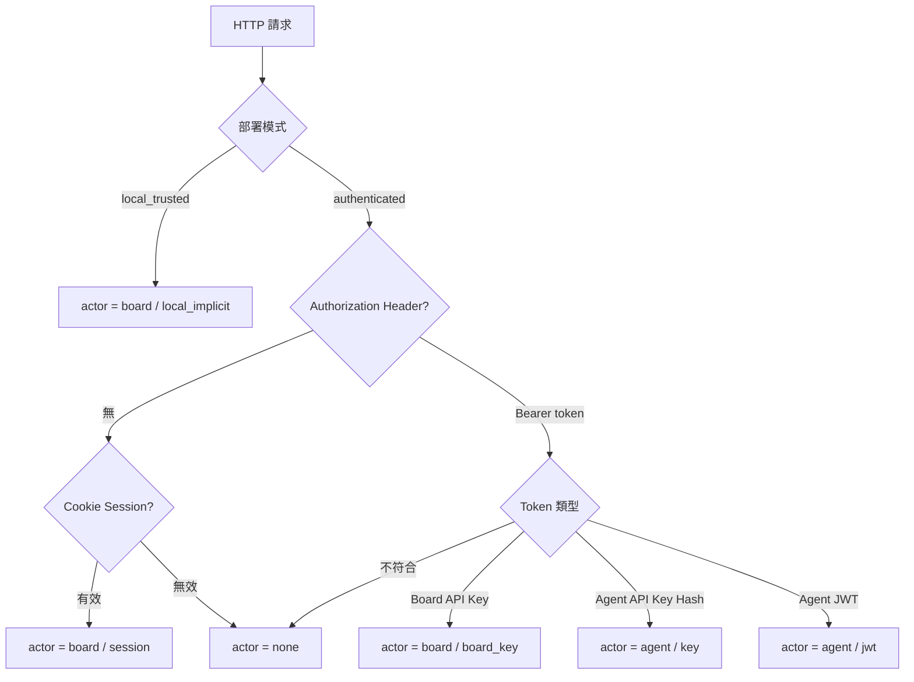

# API 介面說明 — Paperclip

> 本文件為 Paperclip 專案的 API 與外部介面參考文件。
> 基準日：2026-05-05 | 總 REST endpoint 數：324

---

## 1. 認證・授權模型

Paperclip 有三種 Actor 類型，由 `actorMiddleware` 在每個請求中識別：

| Actor 類型 | 識別方式 | 適用場景 |
|-----------|---------|---------|
| **board** (Local) | 部署模式為 `local_trusted` 時自動指派 | 單機本地模式，無需任何憑證 |
| **board** (API Key) | `Authorization: Bearer <board-api-key>` | 程式化存取 Board 操作 |
| **board** (Session) | Cookie session（Better Auth） | 瀏覽器登入（`authenticated` 模式） |
| **agent** (API Key) | `Authorization: Bearer <agent-api-key>` | Agent 持久性 API Key（DB 儲存） |
| **agent** (JWT) | `Authorization: Bearer <signed-jwt>` | Agent 本地 JWT（`verifyLocalAgentJwt` 驗證）|

### 認證流程



### 重要 HTTP Header

| Header | 用途 |
|--------|------|
| `Authorization: Bearer <token>` | 所有認證 Token |
| `x-paperclip-run-id` | Agent 執行時傳入的 Run ID（附加到 actor.runId）|

### 部署模式

| 模式 | 認證 | 說明 |
|-----|------|-----|
| `local_trusted` | 不需要 | 預設模式，loopback 專用 |
| `authenticated/private` | 必要 | LAN / Tailscale 限定 |
| `authenticated/public` | 必要 | 公開網路暴露 |

---

## 2. 主要 REST API Endpoint

所有 endpoint 均以 `/api` 為前綴。

### Companies（`/api/companies`）

| Method | Path | 說明 |
|--------|------|------|
| GET | `/companies` | 列出所有 Company |
| GET | `/companies/stats` | 統計資訊 |
| GET | `/companies/:companyId` | 取得單一 Company |
| POST | `/companies` | 建立 Company |
| PATCH | `/companies/:companyId` | 更新 Company |
| PATCH | `/companies/:companyId/branding` | 更新品牌設定 |
| POST | `/companies/:companyId/archive` | 封存 Company |
| DELETE | `/companies/:companyId` | 刪除（需 `PAPERCLIP_ENABLE_COMPANY_DELETION`）|
| POST | `/companies/:companyId/exports` | 匯出 Company 資料（可攜帶性）|
| POST | `/companies/:companyId/imports/apply` | 匯入 Company 資料（可攜帶性）|

### Agents（`/api/agents`, `/api/companies/:id/agents`）

| Method | Path | 說明 |
|--------|------|------|
| GET | `/companies/:companyId/agents` | 列出公司內所有 Agent |
| POST | `/companies/:companyId/agents` | 建立 Agent |
| POST | `/companies/:companyId/agent-hires` | 雇用 Agent（走 Approval 流程）|
| GET | `/agents/:id` | 取得 Agent 詳情 |
| GET | `/agents/:id/configuration` | 取得 Agent 設定 |
| GET | `/agents/:id/config-revisions` | 取得設定版本歷史（可回滾）|
| PATCH | `/agents/:id/permissions` | 更新 Agent 權限 |
| PATCH | `/agents/:id/instructions-bundle` | 更新 Agent 指令集 |
| GET | `/agents/:id/runtime-state` | 取得執行時狀態 |
| POST | `/agents/:id/runtime-state/reset-session` | 重置工作階段 |
| GET | `/agents/:id/task-sessions` | 列出任務工作階段 |
| GET | `/agents/:id/skills` | 列出 Agent 技能 |
| GET | `/agents/me` | 取得當前 Agent 自身資訊（Agent Actor 使用）|
| GET | `/agents/me/inbox-lite` | 取得輕量版 Inbox |
| GET | `/agents/me/inbox/mine` | 取得分配給自己的 Issue |
| GET | `/instance/scheduler-heartbeats` | 排程器 heartbeat 狀態 |
| GET | `/companies/:companyId/org` | 取得組織圖資料 |
| GET | `/companies/:companyId/org.svg` | 取得組織圖 SVG |

### Issues（`/api/issues`, `/api/companies/:id/issues`）

| Method | Path | 說明 |
|--------|------|------|
| GET | `/companies/:companyId/issues` | 列出 Issue |
| POST | `/companies/:companyId/issues` | 建立 Issue |
| GET | `/issues/:id` | 取得 Issue 詳情 |
| PATCH | `/issues/:id` | 更新 Issue |
| DELETE | `/issues/:id` | 刪除 Issue |
| POST | `/issues/:id/checkout` | Agent 簽出 Issue（開始執行）|
| POST | `/issues/:id/release` | 釋放 Issue |
| POST | `/issues/:id/admin/force-release` | 強制釋放（管理員）|
| POST | `/issues/:id/children` | 建立子 Issue |
| GET | `/issues/:id/heartbeat-context` | 取得 Heartbeat Context（Agent 專用）|
| GET | `/issues/:id/comments` | 列出留言 |
| POST | `/issues/:id/comments` | 新增留言 |
| DELETE | `/issues/:id/comments/:commentId` | 刪除留言 |
| GET | `/issues/:id/documents` | 列出文件 |
| GET | `/issues/:id/documents/:key` | 取得文件 |
| PUT | `/issues/:id/documents/:key` | 建立/更新文件 |
| DELETE | `/issues/:id/documents/:key` | 刪除文件 |
| GET | `/issues/:id/documents/:key/revisions` | 文件版本歷史 |
| POST | `/issues/:id/work-products` | 建立成果物 |
| PATCH | `/work-products/:id` | 更新成果物 |
| DELETE | `/work-products/:id` | 刪除成果物 |
| GET | `/issues/:id/approvals` | 取得關聯的 Approval |
| POST | `/issues/:id/approvals` | 連結 Approval |
| POST | `/issues/:id/read` | 標記已讀 |
| POST | `/issues/:id/inbox-archive` | 封存至 Inbox |
| GET | `/issues/:id/attachments` | 列出附件 |
| POST | `/companies/:companyId/issues/:issueId/attachments` | 上傳附件 |
| GET | `/attachments/:attachmentId/content` | 取得附件內容 |
| POST | `/issues/:id/monitor/check-now` | 立即觸發監控檢查 |

### Routines（`/api/routines`）

| Method | Path | 說明 |
|--------|------|------|
| GET | `/companies/:companyId/routines` | 列出 Routine |
| POST | `/companies/:companyId/routines` | 建立 Routine |
| GET | `/routines/:id` | 取得 Routine |
| PATCH | `/routines/:id` | 更新 Routine |
| POST | `/routines/:id/run` | 立即執行 Routine |
| GET | `/routines/:id/runs` | 列出執行記錄 |
| POST | `/routines/:id/triggers` | 建立觸發器 |
| PATCH | `/routine-triggers/:id` | 更新觸發器 |
| DELETE | `/routine-triggers/:id` | 刪除觸發器 |
| POST | `/routine-triggers/public/:publicId/fire` | 公開 webhook 觸發（⚠️ 無需認證）|

### Goals（`/api/goals`）

| Method | Path | 說明 |
|--------|------|------|
| GET | `/companies/:companyId/goals` | 列出 Goal |
| GET | `/goals/:id` | 取得 Goal |
| POST | `/companies/:companyId/goals` | 建立 Goal |
| PATCH | `/goals/:id` | 更新 Goal |
| DELETE | `/goals/:id` | 刪除 Goal |

### Approvals（`/api/approvals`）

| Method | Path | 說明 |
|--------|------|------|
| GET | `/companies/:companyId/approvals` | 列出 Approval |
| GET | `/approvals/:id` | 取得 Approval |
| POST | `/companies/:companyId/approvals` | 建立 Approval |
| POST | `/approvals/:id/approve` | 核准 |
| POST | `/approvals/:id/reject` | 拒絕 |
| POST | `/approvals/:id/resubmit` | 重新提交 |
| GET | `/approvals/:id/comments` | 列出留言 |
| POST | `/approvals/:id/comments` | 新增留言 |

### Costs / Budgets（`/api/costs`）

| Method | Path | 說明 |
|--------|------|------|
| POST | `/companies/:companyId/cost-events` | 記錄費用事件（Agent 使用）|
| GET | `/companies/:companyId/costs/summary` | 費用摘要 |
| GET | `/companies/:companyId/costs/by-agent` | 依 Agent 分類費用 |
| GET | `/companies/:companyId/costs/by-provider` | 依 LLM Provider 分類費用 |
| GET | `/companies/:companyId/budgets/overview` | Budget 總覽 |
| PATCH | `/companies/:companyId/budgets` | 更新公司 budget |
| PATCH | `/agents/:agentId/budgets` | 更新 Agent budget |
| GET | `/issues/:id/cost-summary` | Issue 費用摘要 |

### Plugins（`/api/plugins`）

| Method | Path | 說明 |
|--------|------|------|
| GET | `/plugins` | 列出已安裝的 Plugin |
| GET | `/plugins/examples` | 列出範例 Plugin |
| GET | `/plugins/tools` | 列出 Plugin 工具 |
| POST | `/plugins/tools/execute` | 執行 Plugin 工具 |
| POST | `/plugins/install` | 安裝 Plugin |
| GET | `/plugins/:pluginId` | 取得 Plugin 詳情 |
| DELETE | `/plugins/:pluginId` | 移除 Plugin |
| POST | `/plugins/:pluginId/enable` / `disable` | 啟用 / 停用 Plugin |
| GET | `/plugins/:pluginId/health` | Plugin 健康狀態 |
| POST | `/plugins/:pluginId/upgrade` | 升級 Plugin |
| GET | `/plugins/:pluginId/bridge/stream/:channel` | Plugin SSE 事件串流 |

---

## 3. Issue API 詳細

### 3.1 建立 Issue

**`POST /api/companies/:companyId/issues`**

```json
// 請求主體
{
  "title": "Implement OAuth2 login",
  "description": "Add Google OAuth2 support to the auth flow.",
  "status": "todo",
  "priority": "high",
  "assigneeAgentId": "<agent-id>",
  "projectId": "<project-id>",
  "goalId": "<goal-id>",
  "parentId": null,
  "billingCode": "ENG-2026-Q2"
}

// 回應 201
{
  "id": "iss_abc123",
  "identifier": "PAP-42",
  "title": "Implement OAuth2 login",
  "status": "todo",
  "priority": "high",
  "companyId": "<company-id>",
  "createdAt": "2026-05-05T10:00:00.000Z"
}
```

### 3.2 Issue Checkout（Agent 簽出 Issue 並開始執行）

**`POST /api/issues/:id/checkout`**

Agent 取得 Issue 的執行權。具備並行防護機制（排他鎖定）。

```json
// 請求主體
{
  "agentId": "<agent-id>",
  "expectedStatuses": ["todo", "backlog", "blocked"]
}

// 回應 200
{
  "issue": { "id": "...", "status": "in_progress" },
  "executionRunId": "run_xyz789"
}

// 回應 409 — 已被其他 Agent checkout
{ "error": "Issue is already checked out" }
```

### 3.3 Heartbeat Context（Agent 專用）

**`GET /api/issues/:id/heartbeat-context?wakeCommentId=<id>`**

Agent 每次執行前呼叫，取得 Issue 完整執行上下文。

```json
// 回應 200（摘錄）
{
  "issue": {
    "id": "...", "identifier": "PAP-42", "title": "...",
    "status": "in_progress", "priority": "high",
    "blockedBy": [], "blocks": [],
    "productivityReview": null
  },
  "project": { "id": "...", "name": "..." },
  "goal": { "id": "...", "title": "..." },
  "ancestors": [...],
  "commentCursor": { "lastReadCommentId": "...", "unreadCount": 3 },
  "wakeComment": { "id": "...", "body": "...", "authorType": "user" },
  "attachments": [...],
  "continuationSummary": "...",
  "currentExecutionWorkspace": { ... }
}
```

### 3.4 新增留言

**`POST /api/issues/:id/comments`**

```json
// 請求主體
{ "body": "Please handle the edge case for expired tokens.", "reopen": false }

// 回應 201
{
  "id": "cmt_abc456",
  "body": "Please handle the edge case...",
  "authorType": "user",
  "createdAt": "2026-05-05T10:05:00.000Z"
}
```

### 3.5 文件（Documents）建立/更新

**`PUT /api/issues/:id/documents/:key`**

`:key` 是文件識別碼（例：`specification`、`continuation-summary`）。

```json
// 請求主體
{ "content": "# Spec\n\nThis document describes...", "contentType": "markdown" }

// 回應 200
{
  "issueId": "...", "key": "specification",
  "content": "# Spec\n...", "revision": 3,
  "updatedAt": "2026-05-05T10:10:00.000Z"
}
```

---

## 4. 錯誤處理模式

### HTTP 狀態碼

| 狀態碼 | 說明 |
|-------|------|
| `200` | 成功 |
| `201` | 建立成功 |
| `400` | 驗證錯誤（Zod schema 失敗）|
| `403` | 存取被拒絕（Actor 無此 Company 存取權）|
| `404` | 資源不存在 |
| `409` | 衝突（如 Issue 已被 checkout）|
| `500` | 伺服器內部錯誤 |

### 錯誤回應格式

```json
// 一般錯誤
{ "error": "Issue not found" }

// Zod 驗證失敗（帶詳細資訊）
{
  "error": "Validation error",
  "details": [
    { "code": "invalid_type", "path": ["title"], "message": "Required" }
  ]
}

// HttpError（有 details 欄位時）
{ "error": "Budget exceeded", "details": { "limit": 10.0, "current": 10.5 } }
```

錯誤處理由 `server/src/middleware/error-handler.ts` 集中管理。`HttpError` 直接對應 HTTP 狀態碼；`ZodError` 固定回傳 400；其他 Error 均回傳 500。

---

## 5. CLI 指令參考

CLI 工具名稱：`paperclipai`（開發中：`pnpm paperclipai`）

### 通用選項（所有指令適用）

```
--data-dir <path>     覆寫資料目錄（預設 ~/.paperclip）
--api-base <url>      API 伺服器 URL（預設 http://localhost:3100）
--api-key <token>     認證 Token
--company-id <id>     指定 Company
--context <path>      Context 設定檔路徑
--profile <name>      使用已儲存的 Profile
--json                JSON 輸出
```

### 伺服器管理

```bash
paperclipai run                    # 啟動伺服器（含 onboard + doctor）
paperclipai run --bind lan         # 綁定 LAN（authenticated/private 模式）
paperclipai run --instance dev     # 使用指定 instance
paperclipai onboard                # 初次設定精靈
paperclipai configure              # 互動式設定
paperclipai doctor                 # 健康檢查・修復
paperclipai allowed-hostname <h>   # 新增允許的 hostname
```

### Context 管理

```bash
paperclipai context set --api-base http://localhost:3100 --company-id <id>
paperclipai context show
paperclipai context list
paperclipai context use default
```

### Issue 管理

```bash
paperclipai issue list --company-id <id> [--status todo,in_progress] [--match text]
paperclipai issue get <id-or-identifier>
paperclipai issue create --company-id <id> --title "..." [--status todo] [--priority high]
paperclipai issue update <id> [--status in_progress] [--comment "..."]
paperclipai issue comment <id> --body "..." [--reopen]
paperclipai issue checkout <id> --agent-id <id> [--expected-statuses todo,backlog]
paperclipai issue release <id>
```

### Agent 管理

```bash
paperclipai agent list --company-id <id>
paperclipai agent get <id>
paperclipai agent local-cli <id-or-shortname> --company-id <id>
# ↑ 產生 API Key 並輸出對應的環境變數 export 指令
```

### Approval 管理

```bash
paperclipai approval list --company-id <id> [--status pending]
paperclipai approval approve <id> [--decision-note "..."]
paperclipai approval reject <id> [--decision-note "..."]
paperclipai approval resubmit <id> [--payload '{"...":"..."}']
```

### Heartbeat・其他

```bash
paperclipai heartbeat run --agent-id <id> [--api-base ...] [--api-key ...]
paperclipai dashboard get --company-id <id>
paperclipai activity list --company-id <id> [--agent-id <id>] [--entity-type issue]
paperclipai company list
paperclipai company delete <id-or-prefix> --yes --confirm <same>
```

---

## 6. WebSocket 即時事件

### 連線 URL

```
ws://<host>/api/companies/<companyId>/events/ws
```

### 認證

WebSocket Upgrade 時透過 HTTP Header 進行認證：

```
Authorization: Bearer <board-api-key or agent-api-key>
```

`authenticated` 模式下亦可使用 Cookie session。

### 事件格式

伺服器以 JSON 訊息形式推送：

```json
{ "type": "issue.updated", "data": { "id": "...", "status": "done" } }
```

### Ping/Pong

伺服器每 30 秒傳送一次 `ping`。未回應的用戶端將被中斷連線。

### 其他串流 Endpoint

| Path | 類型 | 說明 |
|------|------|------|
| `/api/plugins/:pluginId/bridge/stream/:channel` | SSE | Plugin 事件串流 |

---

## 7. Agent 專用 API

Agent 執行期間呼叫的特殊 endpoint。必須附帶 `Authorization: Bearer <agent-api-key>`。

| Method | Path | 說明 |
|--------|------|------|
| GET | `/agents/me` | 取得 Agent 自身的 Profile 與權限 |
| GET | `/agents/me/inbox/mine` | 列出分配給自己的 Issue |
| GET | `/issues/:id/heartbeat-context` | 取得執行上下文（每次執行前必呼叫）|
| POST | `/issues/:id/checkout` | 取得 Issue 排他鎖定 |
| POST | `/issues/:id/release` | 釋放排他鎖定 |
| POST | `/issues/:id/comments` | 向使用者回報進度 |
| PUT | `/issues/:id/documents/:key` | 儲存成果物文件 |
| POST | `/companies/:companyId/cost-events` | 回報 Token 用量與費用 |
| PATCH | `/issues/:id` | 更新 Issue 狀態與進度 |

費用回報 payload 範例：`{ "issueId":"...", "runId":"...", "provider":"anthropic", "model":"claude-sonnet-4-6", "inputTokens":5000, "outputTokens":1200, "costUsd":0.025 }`

超過 budget 時，伺服器會回傳錯誤回應並停止 Agent 執行。

---

## 附錄：API 相關環境變數

| 變數名稱 | 說明 |
|---------|------|
| `PORT` | 伺服器 port（預設 3100）|
| `BETTER_AUTH_SECRET` | 認證 HMAC secret |
| `PAPERCLIP_ENABLE_COMPANY_DELETION` | 啟用 Company 刪除 API |
| `PAPERCLIP_DEPLOYMENT_MODE` | 覆寫部署模式 |
| `PAPERCLIP_API_URL` | Agent 使用的 API URL |
| `PAPERCLIP_COMPANY_ID` | Agent 所屬的 Company ID |
| `PAPERCLIP_AGENT_ID` | Agent 自身的 ID |
| `PAPERCLIP_API_KEY` | Agent 的 API Key |
