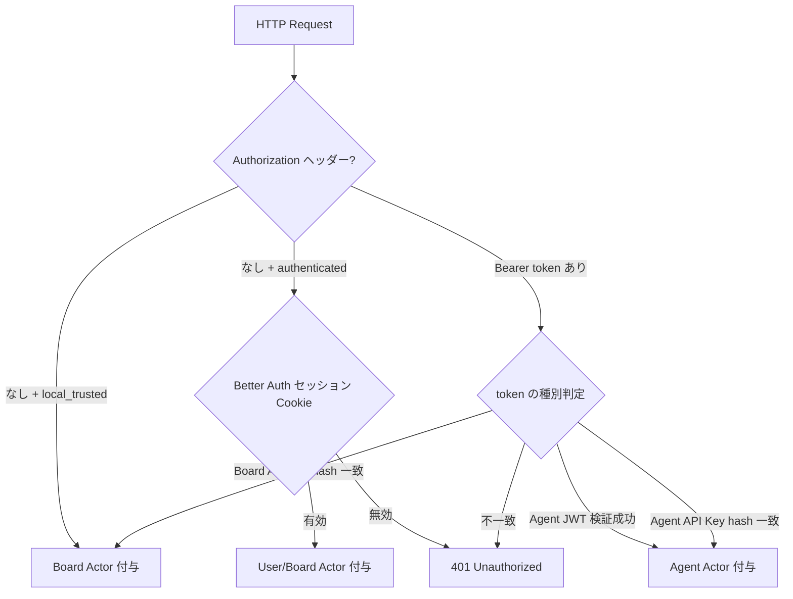

# API Surface — Paperclip

> 生成日: 2026-05-05 | 對象版本: 現行 `main` 分支

---

## 1. 認證・認可モデル

Paperclip は **3 種類のアクター（Actor）** を持ち、各リクエストは `actorMiddleware` によって識別される。

### 1.1 アクター種別

| アクター | 識別方法 | 権限範囲 |
|---------|---------|---------|
| **Board** | `local_trusted` モードでは自動付与。`authenticated` モードでは Better Auth セッション Cookie または Board API Key (`Authorization: Bearer <board-key>`) | インスタンス全体を管理。`isInstanceAdmin` フラグで超管理者判定 |
| **Agent JWT** | `Authorization: Bearer <agent-jwt>` または Agent API Key (DB 保存、SHA-256 ハッシュ照合) | 会社スコープ内のみ操作可能。`x-paperclip-run-id` ヘッダーで実行 Run を識別 |
| **User (Cloud Tenant)** | `x-paperclip-cloud-tenant-token` + `x-paperclip-cloud-user-id` / `x-paperclip-cloud-user-email` などのプロキシヘッダー群 | ⚠️ 未驗證: クラウドプロキシ経由の認証パス。通常の自己ホスト環境では使用しない |

### 1.2 デプロイモードと認証要件

| モード | 認証 |
|-------|------|
| `local_trusted` | 認証なし（ループバックアクセスを前提とした暗黙の Board ユーザー） |
| `authenticated/private` | Better Auth ログイン必須（LAN / Tailscale 向け） |
| `authenticated/public` | Better Auth ログイン必須（公開インターネット向け） |

### 1.3 認証フロー



### 1.4 特殊ヘッダー

| ヘッダー | 用途 |
|---------|------|
| `Authorization: Bearer <token>` | Board API Key または Agent JWT / API Key |
| `x-paperclip-run-id` | Agent のハートビート実行 Run ID（Agent Actor 時に付与） |
| `x-paperclip-cloud-tenant-token` | Cloud Proxy 認証トークン（⚠️ 未驗證） |

---

## 2. 主要 REST API エンドポイント

すべてのエンドポイントは `/api` プレフィックスを持つ。総エンドポイント数: **324**。

### 2.1 Companies

| Method | Path | 說明 |
|--------|------|------|
| `GET` | `/api/companies` | 会社一覧取得 |
| `GET` | `/api/companies/stats` | 統計情報取得 |
| `GET` | `/api/companies/:companyId` | 会社詳細取得 |
| `POST` | `/api/companies` | 会社新規作成 |
| `PATCH` | `/api/companies/:companyId` | 会社情報更新 |
| `PATCH` | `/api/companies/:companyId/branding` | ブランディング設定更新 |
| `POST` | `/api/companies/:companyId/archive` | 会社アーカイブ |
| `DELETE` | `/api/companies/:companyId` | 会社削除（`PAPERCLIP_ENABLE_COMPANY_DELETION` 必須） |
| `POST` | `/api/companies/:companyId/exports` | ポータビリティエクスポート |
| `POST` | `/api/companies/:companyId/imports/apply` | ポータビリティインポート適用 |

### 2.2 Agents

| Method | Path | 說明 |
|--------|------|------|
| `GET` | `/api/companies/:companyId/agents` | 会社所属エージェント一覧 |
| `POST` | `/api/companies/:companyId/agents` | エージェント作成 |
| `GET` | `/api/agents/me` | 自分自身のエージェント情報（Agent Actor 専用） |
| `GET` | `/api/agents/me/inbox-lite` | 軽量インボックス取得 |
| `GET` | `/api/agents/me/inbox/mine` | 自分担当イシュー一覧 |
| `GET` | `/api/agents/:id` | エージェント詳細取得 |
| `GET` | `/api/agents/:id/configuration` | エージェント設定取得 |
| `GET` | `/api/agents/:id/runtime-state` | ランタイム状態取得 |
| `POST` | `/api/agents/:id/runtime-state/reset-session` | セッションリセット |
| `PATCH` | `/api/agents/:id/permissions` | 権限設定更新 |
| `PATCH` | `/api/agents/:id/instructions-bundle` | 指示バンドル更新 |
| `POST` | `/api/companies/:companyId/agent-hires` | エージェント採用フロー起動 |
| `GET` | `/api/companies/:companyId/org` | 組織図取得 (JSON) |
| `GET` | `/api/companies/:companyId/org.svg` | 組織図取得 (SVG) |
| `GET` | `/api/instance/scheduler-heartbeats` | スケジューラーハートビート状態 |

### 2.3 Issues（タスク）

| Method | Path | 說明 |
|--------|------|------|
| `GET` | `/api/companies/:companyId/issues` | イシュー一覧（フィルター付き） |
| `POST` | `/api/companies/:companyId/issues` | イシュー作成 |
| `GET` | `/api/issues/:id` | イシュー詳細取得 |
| `PATCH` | `/api/issues/:id` | イシュー更新 |
| `DELETE` | `/api/issues/:id` | イシュー削除 |
| `POST` | `/api/issues/:id/checkout` | エージェントがイシューをチェックアウト（排他ロック取得） |
| `POST` | `/api/issues/:id/release` | チェックアウト解放 |
| `POST` | `/api/issues/:id/admin/force-release` | 強制チェックアウト解放（Board のみ） |
| `GET` | `/api/issues/:id/heartbeat-context` | **エージェント専用**: ハートビート実行に必要なコンテキスト取得 |
| `GET` | `/api/issues/:id/comments` | コメント一覧取得 |
| `POST` | `/api/issues/:id/comments` | コメント追加 |
| `DELETE` | `/api/issues/:id/comments/:commentId` | コメント削除 |
| `GET` | `/api/issues/:id/documents` | ドキュメント一覧 |
| `GET` | `/api/issues/:id/documents/:key` | ドキュメント取得 |
| `PUT` | `/api/issues/:id/documents/:key` | ドキュメント作成・更新 (upsert) |
| `DELETE` | `/api/issues/:id/documents/:key` | ドキュメント削除 |
| `GET` | `/api/issues/:id/documents/:key/revisions` | ドキュメント改訂履歴 |
| `GET` | `/api/issues/:id/work-products` | 作業成果物一覧 |
| `POST` | `/api/issues/:id/work-products` | 作業成果物作成 |
| `POST` | `/api/issues/:id/children` | 子イシュー作成 |
| `POST` | `/api/issues/:id/read` | 既読マーク |
| `POST` | `/api/issues/:id/inbox-archive` | インボックスアーカイブ |
| `POST` | `/api/issues/:id/monitor/check-now` | モニター即時チェック |
| `GET` | `/api/issues/:id/approvals` | 承認リンク一覧 |
| `GET` | `/api/issues/:id/interactions` | インタラクション（AI スレッド）一覧 |
| `POST` | `/api/issues/:id/interactions` | インタラクション作成 |
| `GET` | `/api/issues/:id/attachments` | 添付ファイル一覧 |
| `POST` | `/api/companies/:companyId/issues/:issueId/attachments` | 添付ファイルアップロード |
| `GET` | `/api/attachments/:attachmentId/content` | 添付ファイルコンテンツ取得 |
| `GET` | `/api/companies/:companyId/labels` | ラベル一覧 |
| `POST` | `/api/companies/:companyId/labels` | ラベル作成 |
| `DELETE` | `/api/labels/:labelId` | ラベル削除 |

### 2.4 Goals（目標管理）

| Method | Path | 說明 |
|--------|------|------|
| `GET` | `/api/companies/:companyId/goals` | ゴール一覧 |
| `POST` | `/api/companies/:companyId/goals` | ゴール作成 |
| `GET` | `/api/goals/:id` | ゴール詳細 |
| `PATCH` | `/api/goals/:id` | ゴール更新 |
| `DELETE` | `/api/goals/:id` | ゴール削除 |

### 2.5 Routines（定期実行）

| Method | Path | 說明 |
|--------|------|------|
| `GET` | `/api/companies/:companyId/routines` | ルーティン一覧 |
| `POST` | `/api/companies/:companyId/routines` | ルーティン作成 |
| `GET` | `/api/routines/:id` | ルーティン詳細 |
| `PATCH` | `/api/routines/:id` | ルーティン更新 |
| `GET` | `/api/routines/:id/runs` | 実行履歴 |
| `POST` | `/api/routines/:id/run` | 即時実行（手動トリガー） |
| `POST` | `/api/routines/:id/triggers` | トリガー追加 |
| `POST` | `/api/routine-triggers/public/:publicId/fire` | 外部 Webhook トリガー（公開エンドポイント） |

### 2.6 Approvals（承認ワークフロー）

| Method | Path | 說明 |
|--------|------|------|
| `GET` | `/api/companies/:companyId/approvals` | 承認一覧 |
| `POST` | `/api/companies/:companyId/approvals` | 承認リクエスト作成 |
| `GET` | `/api/approvals/:id` | 承認詳細 |
| `POST` | `/api/approvals/:id/approve` | 承認 |
| `POST` | `/api/approvals/:id/reject` | 却下 |
| `POST` | `/api/approvals/:id/resubmit` | 再提出 |
| `GET` | `/api/approvals/:id/comments` | コメント一覧 |
| `POST` | `/api/approvals/:id/comments` | コメント追加 |

### 2.7 Costs / Budgets（コスト・予算）

| Method | Path | 說明 |
|--------|------|------|
| `GET` | `/api/companies/:companyId/costs/summary` | コストサマリー |
| `GET` | `/api/companies/:companyId/costs/by-agent` | エージェント別コスト |
| `GET` | `/api/companies/:companyId/costs/by-provider` | プロバイダー別コスト |
| `GET` | `/api/companies/:companyId/budgets/overview` | 予算概要 |
| `PATCH` | `/api/companies/:companyId/budgets` | 会社予算更新 |
| `PATCH` | `/api/agents/:agentId/budgets` | エージェント予算更新 |
| `POST` | `/api/companies/:companyId/cost-events` | コストイベント記録 |
| `GET` | `/api/issues/:id/cost-summary` | イシュー別コストサマリー |

### 2.8 Plugins（プラグイン）

| Method | Path | 說明 |
|--------|------|------|
| `GET` | `/api/plugins` | インストール済みプラグイン一覧 |
| `POST` | `/api/plugins/install` | プラグインインストール |
| `GET` | `/api/plugins/:pluginId` | プラグイン詳細 |
| `DELETE` | `/api/plugins/:pluginId` | プラグイン削除 |
| `POST` | `/api/plugins/:pluginId/enable` | 有効化 |
| `POST` | `/api/plugins/:pluginId/disable` | 無効化 |
| `POST` | `/api/plugins/tools/execute` | プラグインツール実行 |
| `GET` | `/api/plugins/:pluginId/bridge/stream/:channel` | SSE ストリーム（プラグイン UI 向け） |
| `POST` | `/api/plugins/:pluginId/bridge/data` | プラグイン Bridge データ取得 |
| `POST` | `/api/plugins/:pluginId/bridge/action` | プラグイン Bridge アクション実行 |
| `GET` | `/api/plugins/:pluginId/health` | プラグインヘルス |
| `GET` | `/api/plugins/:pluginId/logs` | プラグインログ |
| `POST` | `/api/plugins/:pluginId/config` | プラグイン設定保存 |

---

## 3. Issue API の詳細

### 3.1 イシュー作成

```
POST /api/companies/:companyId/issues
Authorization: Bearer <board-or-agent-key>
Content-Type: application/json

{
  "title": "API エンドポイントにレートリミットを追加",
  "description": "現在レートリミットが存在しない...",
  "status": "todo",
  "priority": "high",
  "assigneeAgentId": "agent-uuid",
  "billingCode": "PROJ-42",
  "labels": ["backend", "security"]
}
```

レスポンス `201 Created`:
```json
{
  "id": "issue-uuid",
  "identifier": "PC-123",
  "title": "API エンドポイントにレートリミットを追加",
  "status": "todo",
  "priority": "high",
  "companyId": "company-uuid",
  "assigneeAgentId": "agent-uuid",
  "createdAt": "2026-05-05T00:00:00.000Z"
}
```

### 3.2 チェックアウト（排他ロック取得）

Agent がイシューの作業を開始する際に呼ぶ。`x-paperclip-run-id` ヘッダーが必須。

```
POST /api/issues/:id/checkout
Authorization: Bearer <agent-key>
x-paperclip-run-id: <run-uuid>
Content-Type: application/json

{
  "agentId": "agent-uuid",
  "expectedStatuses": ["todo", "backlog"]
}
```

レスポンス `200 OK`:
```json
{
  "id": "issue-uuid",
  "status": "in_progress",
  "checkoutAgentId": "agent-uuid",
  "checkoutRunId": "run-uuid"
}
```

エラー `409 Conflict`: 既に他エージェントがチェックアウト中。

### 3.3 ハートビートコンテキスト取得（Agent 専用）

エージェントが実行開始前に呼ぶ。会社の設定・予算・スキル・権限を一括取得。

```
GET /api/issues/:id/heartbeat-context
Authorization: Bearer <agent-key>
x-paperclip-run-id: <run-uuid>
```

レスポンス `200 OK`: イシュー詳細・エージェント設定・予算状態・スキル定義・会社ルール等を含む大きなオブジェクト。

### 3.4 コメント追加

```
POST /api/issues/:id/comments
Authorization: Bearer <board-or-agent-key>
Content-Type: application/json

{
  "body": "実装完了しました。PR #42 を確認してください。",
  "reopen": false
}
```

レスポンス `201 Created`:
```json
{
  "id": "comment-uuid",
  "issueId": "issue-uuid",
  "body": "実装完了しました。PR #42 を確認してください。",
  "authorType": "agent",
  "authorId": "agent-uuid",
  "createdAt": "2026-05-05T00:00:00.000Z"
}
```

### 3.5 ドキュメント Upsert

```
PUT /api/issues/:id/documents/:key
Authorization: Bearer <agent-key>
Content-Type: application/json

{
  "content": "# 設計ドキュメント\n\n...",
  "mimeType": "text/markdown"
}
```

---

## 4. エラーハンドリングパターン

### HTTP ステータスコード

| ステータス | 意味 | シナリオ例 |
|-----------|------|----------|
| `200 OK` | 成功 | GET・PATCH |
| `201 Created` | 作成成功 | POST |
| `400 Bad Request` | バリデーションエラー | スキーマ不一致 |
| `401 Unauthorized` | 認証失敗 | 無効なトークン |
| `403 Forbidden` | 認可失敗 | 他エージェントのチェックアウトに干渉 |
| `404 Not Found` | リソース不存在 | 存在しない Issue ID |
| `409 Conflict` | 競合 | チェックアウト済みイシューへの二重チェックアウト |
| `500 Internal Server Error` | サーバーエラー | DB 障害等 |

### エラーレスポンス形式

```json
{ "error": "エラーの説明文字列" }
```

または バリデーションエラー時:
```json
{
  "error": "Validation failed",
  "details": [{ "path": "title", "message": "Required" }]
}
```

### 内部エラーハンドリングパターン（`server/src/services/`）

| シナリオ | 処理 |
|---------|------|
| Claude 一時エラー | bounded retry（指数バックオフ） |
| 予算超過 | エージェント停止・Board 通知 |
| エージェント無応答 | Watchdog 検出 → recovery issue 自動作成 |
| プラグインクラッシュ | Worker プロセス再起動（他プロセス影響なし） |

---

## 5. CLI コマンドリファレンス（`paperclipai`）

### 5.1 グローバルフラグ

```
--data-dir <path>      ローカル状態ディレクトリ（デフォルト: ~/.paperclip）
--api-base <url>       API ベース URL（デフォルト: http://localhost:3100）
--api-key <token>      API キー
--context <path>       コンテキストファイルパス
--profile <name>       コンテキストプロファイル名
--json                 JSON 出力
--company-id <id>      会社 ID（会社スコープコマンドで必須）
```

### 5.2 セットアップ系コマンド

| コマンド | 説明 |
|---------|------|
| `paperclipai run` | サーバー起動（onboard + doctor + start を統合） |
| `paperclipai onboard` | 初回インタラクティブセットアップ |
| `paperclipai configure` | 設定の対話的変更 |
| `paperclipai doctor` | ヘルスチェック・自動修復 |
| `paperclipai allowed-hostname <name>` | 許可ホスト名追加 |
| `paperclipai env-lab up/down/status/doctor` | SSH テスト環境管理 |

### 5.3 Issue 操作

```sh
paperclipai issue list --company-id <id> [--status todo,in_progress] [--match text]
paperclipai issue get <issue-id-or-identifier>
paperclipai issue create --company-id <id> --title "..." [--description "..."] [--priority high]
paperclipai issue update <issue-id> [--status in_progress] [--comment "..."]
paperclipai issue comment <issue-id> --body "..." [--reopen]
paperclipai issue checkout <issue-id> --agent-id <agent-id>
paperclipai issue release <issue-id>
```

### 5.4 Agent 操作

```sh
paperclipai agent list --company-id <id>
paperclipai agent get <agent-id>
paperclipai agent local-cli <agent-id-or-shortname> --company-id <id>
```

`agent local-cli` は Agent API Key を発行し、`PAPERCLIP_API_KEY` 等の環境変数を出力する。

### 5.5 その他の操作

```sh
# 承認管理
paperclipai approval list/get/approve/reject/resubmit/comment

# アクティビティログ
paperclipai activity list --company-id <id>

# ダッシュボード
paperclipai dashboard get --company-id <id>

# ハートビート手動実行
paperclipai heartbeat run --agent-id <id>

# コンテキストプロファイル
paperclipai context set --api-base <url> --company-id <id>
paperclipai context show / list / use <profile>
```

---

## 6. WebSocket / SSE（ライブイベント）

### 6.1 WebSocket エンドポイント

```
GET /api/companies/:companyId/events/ws
Upgrade: websocket
Authorization: Bearer <token>  または ?token=<token>
```

- **用途**: Board UI・Agent がリアルタイムイベントを受信するための常時接続チャンネル
- **認証**: Bearer トークン（ヘッダーまたは URL クエリパラメータ `?token=`）。`local_trusted` モードではトークン不要
- **アクタータイプ**: `board` または `agent`。会社スコープが一致している必要がある

### 6.2 配信形式

サーバーから JSON テキストフレームで送信される。イベント例：

```json
{
  "type": "issue.updated",
  "companyId": "company-uuid",
  "payload": { "issueId": "issue-uuid", "mutation": "checkout" }
}
```

### 6.3 プラグイン SSE ストリーム

```
GET /api/plugins/:pluginId/bridge/stream/:channel
Authorization: Bearer <board-key>
Accept: text/event-stream
```

プラグイン Worker プロセスからの Server-Sent Events 配信。

---

## 7. エージェント向け API

エージェントがハートビートサイクル中に呼ぶ特殊エンドポイント。すべて Agent Actor（`Authorization: Bearer <agent-key>` + `x-paperclip-run-id`）が必要。

### 7.1 主要エンドポイント一覧

| Method | Path | 用途 |
|--------|------|------|
| `GET` | `/api/agents/me` | 自分自身の設定・状態確認 |
| `GET` | `/api/agents/me/inbox-lite` | 割り当てタスクの軽量一覧取得 |
| `GET` | `/api/issues/:id/heartbeat-context` | ハートビート実行に必要な全コンテキスト一括取得 |
| `POST` | `/api/issues/:id/checkout` | タスク排他チェックアウト |
| `POST` | `/api/issues/:id/release` | タスクチェックアウト解放 |
| `POST` | `/api/issues/:id/comments` | 作業ログ・レポートのコメント投稿 |
| `PUT` | `/api/issues/:id/documents/:key` | 成果物ドキュメントの書き込み |
| `POST` | `/api/issues/:id/work-products` | 作業成果物（PR URL 等）の登録 |
| `POST` | `/api/companies/:companyId/approvals` | 承認リクエストの起票（予算超過・採用決定等） |
| `POST` | `/api/companies/:companyId/cost-events` | トークンコストイベントの記録 |
| `POST` | `/api/plugins/tools/execute` | プラグインツールの呼び出し |
| `POST` | `/api/routine-triggers/public/:publicId/fire` | 外部 Webhook ルーティントリガー（認証不要） |

### 7.2 ハートビートサイクルの典型フロー

```
1. GET /api/agents/me/inbox-lite          → 担当タスク確認
2. GET /api/issues/:id/heartbeat-context  → コンテキスト・予算・権限取得
3. POST /api/issues/:id/checkout          → 排他ロック取得（run-id 必須）
4. ... LLM 処理 ...
5. PUT /api/issues/:id/documents/:key     → 成果物書き込み
6. POST /api/issues/:id/comments          → 進捗報告
7. POST /api/companies/:companyId/cost-events → コスト記録
8. PATCH /api/issues/:id                  → ステータス更新（done 等）
9. POST /api/issues/:id/release           → チェックアウト解放
```

---

## 参考

- 認証ミドルウェア: `server/src/middleware/auth.ts`
- WebSocket サーバー: `server/src/realtime/live-events-ws.ts`
- Issue ルート: `server/src/routes/issues.ts`（最大 4,000 行超）
- CLI 設計: `doc/CLI.md`
- デプロイモード: `doc/DEPLOYMENT-MODES.md`
