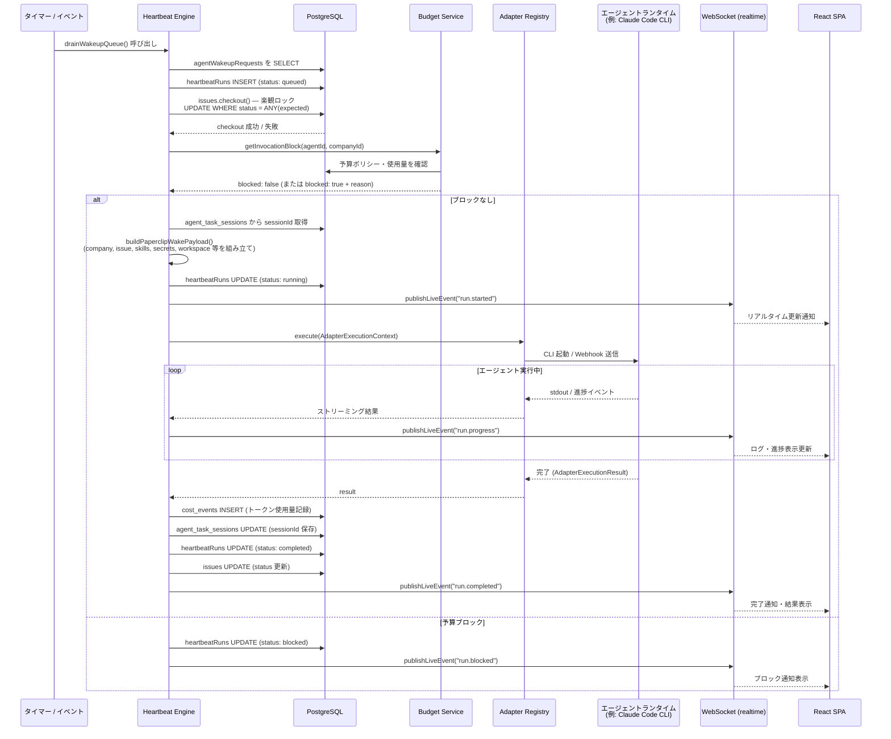
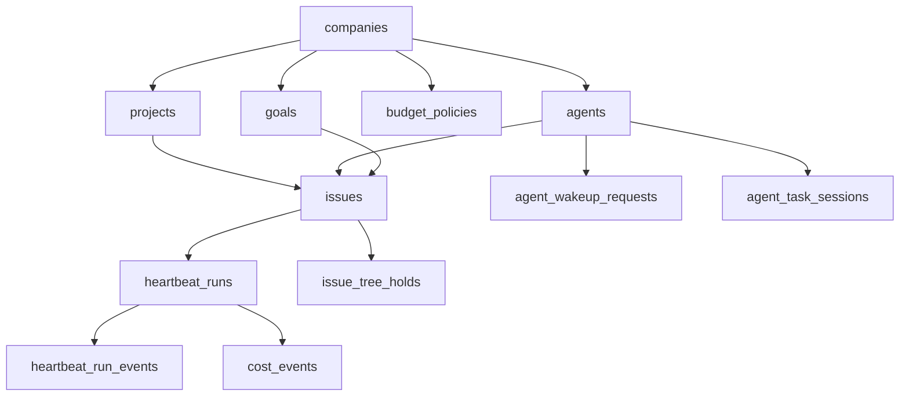

# Paperclip システムアーキテクチャ

> **概要**: Paperclip は AI エージェントチームを「会社」として運営する Node.js + React 製 Control Plane。
> エージェントの雇用・組織図・目標・予算・ガバナンスを管理するオーケストレーション基盤。

---

## 1. 高層アーキテクチャ


---

## 2. コンポーネント一覧

| コンポーネント | 職責 | 関鍵ファイル / ディレクトリ | 上流依存 | 下流依存 |
|-------------|------|--------------------------|---------|---------|
| **React SPA** | ダッシュボード UI・リアルタイム表示 | `ui/src/` | — | Express API, WebSocket |
| **CLI** | セットアップ・ヘルスチェック・タスク管理 | `cli/src/` | — | Express API |
| **Express App** | HTTP ルーティング・Middleware 管理 | `server/src/app.ts`, `server/src/routes/` | React SPA, CLI | Service Layer, Auth |
| **Better Auth** | 認証・セッション管理 | `server/src/auth/` | Express | DB (sessions テーブル) |
| **Heartbeat Engine** | エージェント起動・ライフサイクル管理（中核） | `server/src/services/heartbeat.ts` | Adapter Registry, Budget Service | DB, WebSocket, Storage |
| **Adapter Registry** | 異種エージェントランタイムの統一インターフェース | `server/src/adapters/registry.ts` | Heartbeat Engine | 各 Adapter パッケージ |
| **Adapter パッケージ群** | 各エージェントランタイム実行 | `packages/adapters/*/` | Adapter Registry | エージェント CLI / Webhook |
| **Budget Service** | 階層的予算ポリシー適用 | `server/src/services/budgets.ts` | Heartbeat Engine | DB (cost_events, budget_policies) |
| **Issue Service** | タスク管理・楽観ロック checkout | `server/src/services/issues.ts` | Routes, Heartbeat Engine | DB (issues テーブル) |
| **Plugin Worker Manager** | out-of-process プラグイン管理 | `server/src/services/plugin-worker-manager.ts` | App 初期化 | Plugin Worker プロセス (IPC) |
| **Routine Service** | cron / webhook トリガーによる定期 Issue 生成 | `server/src/services/routines.ts` | App 初期化 | Issue Service, Heartbeat Engine |
| **Recovery System** | 起動時の孤立実行検出・復旧 | `server/src/services/recovery/` | App 初期化 (startup) | DB, Heartbeat Engine |
| **Approval Service** | ガバナンス承認フロー管理 | `server/src/services/approvals.ts` | Routes | DB (approvals テーブル) |
| **Activity Log** | 全操作の監査ログ・プラグインイベントバス橋渡し | `server/src/services/activity-log.ts` | 全 Services | DB, Plugin Event Bus |
| **WebSocket (realtime)** | UI へのリアルタイムイベント Push | `server/src/realtime/` | Heartbeat Engine, Services | React SPA (LiveUpdatesProvider) |
| **DB スキーマ** | Drizzle テーブル定義・マイグレーション | `packages/db/src/schema/` (~70テーブル) | — | ORM 経由で全 Services |
| **Plugin SDK** | プラグイン開発者向け API 定義 | `packages/plugins/sdk/src/` | — | Plugin Worker プロセス |
| **Shared パッケージ** | 型定義・定数・ユーティリティ | `packages/shared/src/` | — | server, ui, cli, adapters |
| **MCP Server** | エージェント向け MCP ツール提供 | `packages/mcp-server/` | Plugin Worker | エージェントランタイム |

---

## 3. 分層設計 / Module Boundary

```
┌─────────────────────────────────────────────────────┐
│ Presentation Layer                                   │
│  React SPA (ui/)          CLI (cli/)                │
│  TanStack Query / Router  Commander.js              │
└───────────────────────┬─────────────────────────────┘
                        │ HTTP / WebSocket
┌───────────────────────▼─────────────────────────────┐
│ API Gateway Layer (server/src/app.ts + routes/)      │
│  Express Middleware Stack                            │
│  Route Handlers (薄いラッパー、Service 呼び出しのみ)   │
│  Authentication (Better Auth)                        │
└───────────────────────┬─────────────────────────────┘
                        │ 関数呼び出し
┌───────────────────────▼─────────────────────────────┐
│ Service Layer (server/src/services/)                 │
│  Heartbeat Engine  Budget Service  Issue Service     │
│  Plugin Manager    Routine Service Recovery System   │
│  Approval Service  Activity Log    Cost Service      │
│  【ルール】: 他 Service を直接インポート可、Route は不可│
└──────────┬──────────────────────┬────────────────────┘
           │ Adapter 呼び出し       │ ORM クエリ
┌──────────▼──────────┐  ┌────────▼───────────────────┐
│ Adapter Layer        │  │ Data Access Layer           │
│ (server/src/adapters/│  │ Drizzle ORM                │
│  + packages/adapters)│  │ packages/db/src/schema/    │
│  統一インターフェース  │  │ ~70テーブル                 │
└──────────┬──────────┘  └────────┬───────────────────┘
           │ child_process / HTTP  │ SQL
┌──────────▼──────────┐  ┌────────▼───────────────────┐
│ Agent Runtime Layer  │  │ Storage Layer              │
│ Claude Code CLI      │  │ PostgreSQL (embedded / ext)│
│ Codex / Gemini CLI   │  │ File Storage (local / S3)  │
│ OpenClaw Webhook     │  └────────────────────────────┘
└─────────────────────┘
```

**Module Boundary ルール**:
- Route Handler は Service のみ呼び出す（DB に直接アクセスしない）
- Service 層は Adapter Registry 経由でのみエージェントランタイムを起動する
- Plugin Worker は IPC (child_process) 経由でのみ Host Services にアクセスし、DB に直接触れない
- 共有型は `packages/shared/` に集約し、循環依存を防ぐ

---

## 4. 通信パターン

| パターン | 使用箇所 | 実装 |
|---------|---------|------|
| **Sync HTTP (REST)** | UI ↔ API, CLI ↔ API | Express.js + TanStack Query |
| **WebSocket (Push)** | サーバー → UI のリアルタイムイベント | `server/src/realtime/` + `LiveUpdatesProvider` |
| **DB-backed Queue (Async)** | Heartbeat 実行キュー | `agentWakeupRequests` → `heartbeatRuns` テーブル |
| **IPC (child_process)** | Plugin Worker ↔ Host Services | `plugin-worker-manager.ts` + Plugin SDK |
| **HTTP Webhook (Fire-and-forget)** | `openclaw_gateway` アダプター | OpenClaw エージェントへの非同期通知 |
| **Pub/Sub (Domain Events)** | Plugin イベントシステム | `plugin-event-bus.ts` → Plugin Worker |
| **Optimistic Lock (DB)** | Issue checkout の排他制御 | `UPDATE WHERE status = ANY(expectedStatuses)` |
| **JWT** | エージェント ↔ API 認証 | `createLocalAgentJwt()` でエージェントごとに発行 |

---

## 5. 関鍵設計決策と Trade-off

### 5.1 DB-backed Queue（永続キュー）
**決策**: エージェント起動リクエストをインメモリキューではなく `agentWakeupRequests` テーブルに書き込む。

**根拠**: VM / コンテナが ephemeral な環境でサーバーが予期せず再起動しても、未処理のリクエストが失われない。

**Trade-off**: DB I/O が増加するが、信頼性を優先。

### 5.2 Embedded PostgreSQL
**決策**: `DATABASE_URL` 未設定時は `embedded-postgres` パッケージで PostgreSQL をプロセス内起動。

**根拠**: ゼロ設定でのローカル起動を実現（`paperclipai run` だけで動作）。

**Trade-off**: 本番環境では外部 Postgres への切り替えが必要。マルチインスタンス構成不可。

### 5.3 out-of-process Plugin Worker
**決策**: プラグインを親プロセスと同一プロセスではなく、子プロセスとして起動。

**根拠**: プラグインのクラッシュがサーバー本体に影響しない。能力ゲート（Capability Gate）によるサンドボックス化が可能。

**Trade-off**: IPC オーバーヘッドが発生。プラグインのデバッグが若干複雑。

### 5.4 Adapter Pattern for Agent Runtimes
**決策**: 各エージェントランタイムを `ServerAdapterModule` インターフェース経由で統一。

**根拠**: Claude Code、Codex、Gemini 等を同一コアロジックで扱える。新規エージェント追加時の変更範囲を Adapter パッケージに限定。

**Trade-off**: ⚠️ 未驗證 — 各ランタイムの高度な機能（ストリーミング応答の差異等）がインターフェースに収まりきらない可能性。

### 5.5 9000 行モノリシック Heartbeat Service
**決策**: `heartbeat.ts` がエージェントライフサイクルの全フェーズを一ファイルで管理。

**根拠**: コンテキスト切り替えコスト削減。ハートビートの全ステップをトレースしやすい。

**Trade-off**: ファイルサイズが巨大で変更時の競合リスクが高い。将来的な分割リファクタリングが課題。

### 5.6 Deployment Mode（local_trusted / authenticated）
**決策**: デフォルトは認証なしの `local_trusted` モード。

**根拠**: ローカル開発者の摩擦を最小化。シングルユーザー前提ならログイン不要。

**Trade-off**: LAN / インターネット露出時は明示的に `authenticated` モードへの切り替えが必要。

---

## 6. Heartbeat 実行シーケンス図



---

## 補足: 主要 DB テーブル関係（概略）



---

*生成日: 2026-05-05 — ソース: `.trace/_context/` コンテキストファイル群 + コードベース直接読取*
