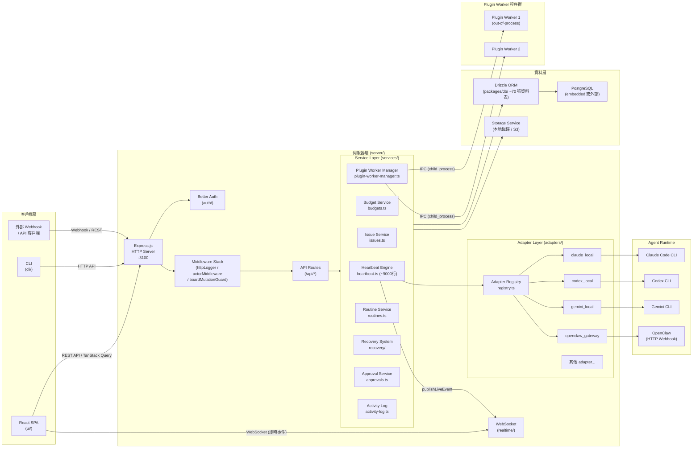
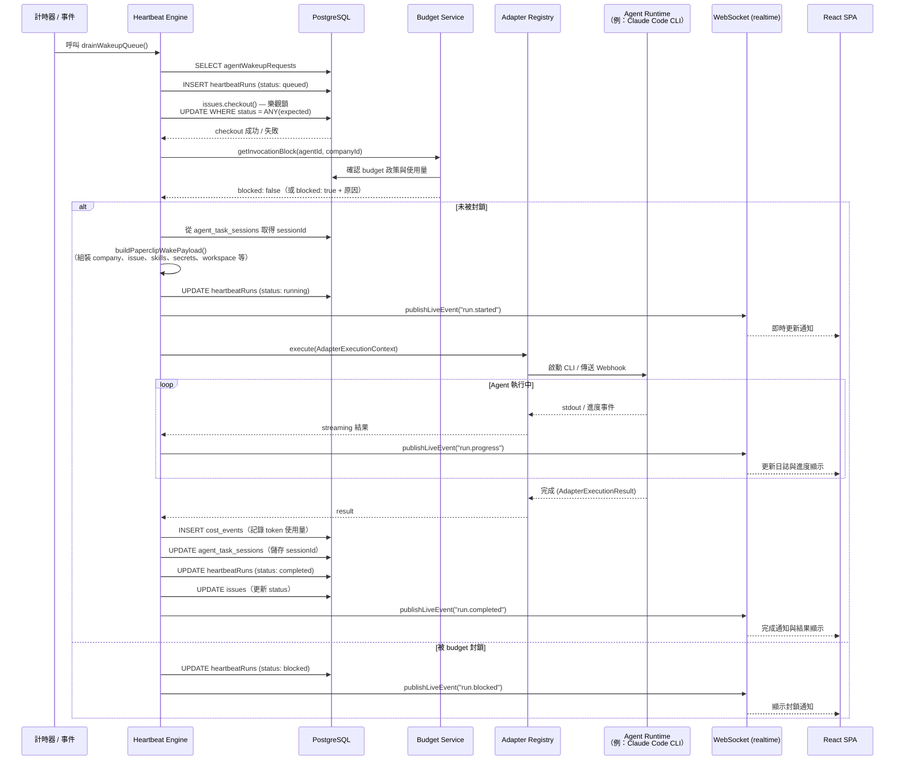
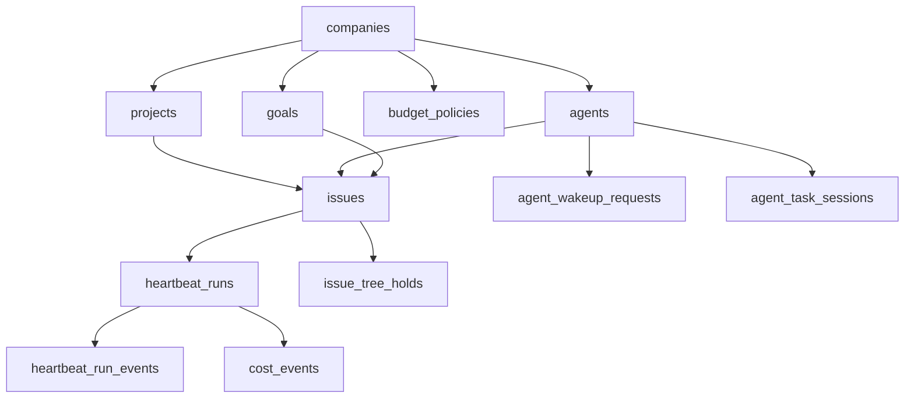

# Paperclip 系統架構

> **概要**：Paperclip 是以 Node.js + React 開發的 Control Plane，將 AI agent 團隊作為「公司」來運營。
> 負責管理 agent 的雇用、組織架構、目標、budget 與 governance 的 orchestration 基礎設施。

---

## 1. 高層架構



---

## 2. 元件清單

| 元件 | 職責 | 關鍵檔案 / 目錄 | 上游依賴 | 下游依賴 |
|------|------|----------------|---------|---------|
| **React SPA** | Dashboard UI、即時顯示 | `ui/src/` | — | Express API, WebSocket |
| **CLI** | 設定、健康檢查、任務管理 | `cli/src/` | — | Express API |
| **Express App** | HTTP routing、middleware 管理 | `server/src/app.ts`, `server/src/routes/` | React SPA, CLI | Service Layer, Auth |
| **Better Auth** | 身份驗證、session 管理 | `server/src/auth/` | Express | DB (sessions 資料表) |
| **Heartbeat Engine** | Agent 啟動、生命週期管理（核心） | `server/src/services/heartbeat.ts` | Adapter Registry, Budget Service | DB, WebSocket, Storage |
| **Adapter Registry** | 異質 agent runtime 的統一介面 | `server/src/adapters/registry.ts` | Heartbeat Engine | 各 adapter 套件 |
| **Adapter 套件群** | 各 agent runtime 執行 | `packages/adapters/*/` | Adapter Registry | Agent CLI / Webhook |
| **Budget Service** | 階層式 budget 政策套用 | `server/src/services/budgets.ts` | Heartbeat Engine | DB (cost_events, budget_policies) |
| **Issue Service** | 任務管理、樂觀鎖 checkout | `server/src/services/issues.ts` | Routes, Heartbeat Engine | DB (issues 資料表) |
| **Plugin Worker Manager** | out-of-process plugin 管理 | `server/src/services/plugin-worker-manager.ts` | App 初始化 | Plugin Worker 程序 (IPC) |
| **Routine Service** | cron / webhook 觸發的定期 issue 生成 | `server/src/services/routines.ts` | App 初始化 | Issue Service, Heartbeat Engine |
| **Recovery System** | 啟動時孤立執行偵測與復原 | `server/src/services/recovery/` | App 初始化 (startup) | DB, Heartbeat Engine |
| **Approval Service** | Governance 審批流程管理 | `server/src/services/approvals.ts` | Routes | DB (approvals 資料表) |
| **Activity Log** | 所有操作的稽核日誌、plugin 事件匯流排橋接 | `server/src/services/activity-log.ts` | 所有 Service | DB, Plugin Event Bus |
| **WebSocket (realtime)** | 向 UI 推送即時事件 | `server/src/realtime/` | Heartbeat Engine, Services | React SPA (LiveUpdatesProvider) |
| **DB Schema** | Drizzle 資料表定義與 migration | `packages/db/src/schema/`（~70 張資料表） | — | 經 ORM 供所有 Service 使用 |
| **Plugin SDK** | Plugin 開發者 API 定義 | `packages/plugins/sdk/src/` | — | Plugin Worker 程序 |
| **Shared 套件** | 型別定義、常數、工具函式 | `packages/shared/src/` | — | server, ui, cli, adapters |
| **MCP Server** | 提供 agent 使用的 MCP 工具 | `packages/mcp-server/` | Plugin Worker | Agent runtime |

---

## 3. 分層設計 / Module Boundary

```
┌─────────────────────────────────────────────────────┐
│ Presentation Layer                                   │
│  React SPA (ui/)          CLI (cli/)                │
│  TanStack Query / Router  Commander.js              │
└───────────────────────┬─────────────────────────────┘
                        │ HTTP / WebSocket
┌───────────────────────▼─────────────────────────────┐
│ API Gateway Layer (server/src/app.ts + routes/)      │
│  Express Middleware Stack                            │
│  Route Handlers（薄層封裝，僅負責呼叫 Service）        │
│  Authentication (Better Auth)                        │
└───────────────────────┬─────────────────────────────┘
                        │ 函式呼叫
┌───────────────────────▼─────────────────────────────┐
│ Service Layer (server/src/services/)                 │
│  Heartbeat Engine  Budget Service  Issue Service     │
│  Plugin Manager    Routine Service Recovery System   │
│  Approval Service  Activity Log    Cost Service      │
│  【規則】：可直接匯入其他 Service，不可匯入 Route       │
└──────────┬──────────────────────┬────────────────────┘
           │ Adapter 呼叫          │ ORM 查詢
┌──────────▼──────────┐  ┌────────▼───────────────────┐
│ Adapter Layer        │  │ Data Access Layer           │
│ (server/src/adapters/│  │ Drizzle ORM                │
│  + packages/adapters)│  │ packages/db/src/schema/    │
│  統一介面             │  │ ~70 張資料表                │
└──────────┬──────────┘  └────────┬───────────────────┘
           │ child_process / HTTP  │ SQL
┌──────────▼──────────┐  ┌────────▼───────────────────┐
│ Agent Runtime Layer  │  │ Storage Layer              │
│ Claude Code CLI      │  │ PostgreSQL (embedded / 外部)│
│ Codex / Gemini CLI   │  │ 檔案儲存 (本地 / S3)        │
│ OpenClaw Webhook     │  └────────────────────────────┘
└─────────────────────┘
```

**Module Boundary 規則**：
- Route Handler 只呼叫 Service（不直接存取 DB）
- Service 層只透過 Adapter Registry 啟動 agent runtime
- Plugin Worker 只透過 IPC (child_process) 存取 Host Service，不直接操作 DB
- 共用型別集中於 `packages/shared/`，防止循環依賴

---

## 4. 通訊模式

| 模式 | 使用場景 | 實作方式 |
|------|---------|---------|
| **Sync HTTP (REST)** | UI ↔ API, CLI ↔ API | Express.js + TanStack Query |
| **WebSocket (Push)** | 伺服器 → UI 的即時事件 | `server/src/realtime/` + `LiveUpdatesProvider` |
| **DB-backed Queue (非同步)** | Heartbeat 執行 queue | `agentWakeupRequests` → `heartbeatRuns` 資料表 |
| **IPC (child_process)** | Plugin Worker ↔ Host Service | `plugin-worker-manager.ts` + Plugin SDK |
| **HTTP Webhook (Fire-and-forget)** | `openclaw_gateway` adapter | 非同步通知 OpenClaw agent |
| **Pub/Sub (Domain Events)** | Plugin 事件系統 | `plugin-event-bus.ts` → Plugin Worker |
| **Optimistic Lock (DB)** | Issue checkout 互斥控制 | `UPDATE WHERE status = ANY(expectedStatuses)` |
| **JWT** | Agent ↔ API 身份驗證 | 以 `createLocalAgentJwt()` 為每個 agent 發行 |

---

## 5. 關鍵設計決策與 Trade-off

### 5.1 DB-backed Queue（持久化 Queue）
**決策**：將 agent 啟動請求寫入 `agentWakeupRequests` 資料表，而非使用記憶體內 queue。

**理由**：即使在 VM / 容器為 ephemeral 的環境下伺服器意外重啟，未處理的請求也不會遺失。

**Trade-off**：DB I/O 增加，但優先確保可靠性。

### 5.2 Embedded PostgreSQL
**決策**：未設定 `DATABASE_URL` 時，以 `embedded-postgres` 套件在程序內啟動 PostgreSQL。

**理由**：實現零設定的本地啟動（只需執行 `paperclipai run` 即可運作）。

**Trade-off**：正式環境需切換至外部 Postgres。不支援多實例架構。

### 5.3 Out-of-Process Plugin Worker
**決策**：以子程序而非同一程序啟動 plugin。

**理由**：plugin 崩潰不影響主伺服器程序。可透過 Capability Gate 實現沙箱化。

**Trade-off**：產生 IPC 開銷。plugin 除錯略為複雜。

### 5.4 Adapter Pattern for Agent Runtimes
**決策**：透過 `ServerAdapterModule` 介面統一各 agent runtime。

**理由**：可以相同的核心邏輯處理 Claude Code、Codex、Gemini 等不同 runtime。新增 agent 時，變更範圍限定在 adapter 套件內。

**Trade-off**：⚠️ 未驗證 — 各 runtime 的進階功能（如 streaming 回應的差異）可能無法完全納入介面規範。

### 5.5 9000 行單體式 Heartbeat Service
**決策**：`heartbeat.ts` 以單一檔案管理 agent 生命週期的所有階段。

**理由**：降低上下文切換成本。便於追蹤 heartbeat 的完整執行步驟。

**Trade-off**：檔案體積龐大，修改時衝突風險高。未來的拆分重構是待解決的技術債。

### 5.6 Deployment Mode（local_trusted / authenticated）
**決策**：預設採用不需身份驗證的 `local_trusted` 模式。

**理由**：最小化本地開發者的摩擦。單一使用者前提下不需登入。

**Trade-off**：暴露於 LAN / 網際網路時，需明確切換至 `authenticated` 模式。

---

## 6. Heartbeat 執行序列圖



---

## 補充：主要 DB 資料表關係（概覽）



---

*生成日期：2026-05-05 — 來源：`.trace/_context/` 脈絡檔案群 + 直接讀取程式碼庫*
