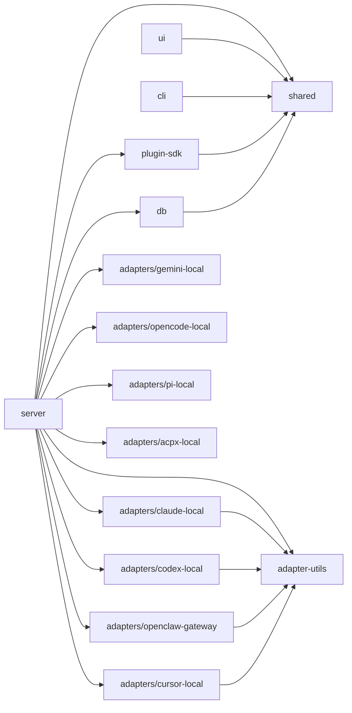

# Codebase Map — 程式碼地圖

## 目錄結構注解

```
paperclip/
│
├── server/                   # 【核心】Express.js API 伺服器
│   └── src/
│       ├── index.ts          # 伺服器入口點（DB 初始化與啟動）
│       ├── app.ts            # Express 應用程式（所有路由註冊）
│       ├── config.ts         # 設定載入（ENV + config.json）
│       ├── config-file.ts    # config.json 的讀寫
│       ├── routes/           # HTTP 路由處理器（40+ 個檔案）
│       │   ├── issues.ts     # 【最大】任務管理 API（超過 3500 行）
│       │   ├── agents.ts     # Agent CRUD
│       │   ├── companies.ts  # 公司管理
│       │   ├── auth.ts       # 認證（Better Auth）
│       │   ├── heartbeat.ts  # Heartbeat 觸發
│       │   └── ...
│       ├── services/         # 業務邏輯（80+ 個檔案）
│       │   ├── heartbeat.ts  # 【核心】Heartbeat 執行引擎（9000 行）
│       │   ├── issues.ts     # 任務狀態管理與樂觀鎖
│       │   ├── budgets.ts    # Budget 策略與成本強制
│       │   ├── secrets.ts    # Secret 管理（加密）
│       │   ├── routines.ts   # 已排程的 routine
│       │   ├── approvals.ts  # Board 核准工作流程
│       │   ├── plugin-*.ts   # Plugin 系統（20+ 個檔案）
│       │   └── ...
│       ├── adapters/         # Agent adapter registry
│       │   ├── registry.ts   # 所有 adapter 的註冊與查詢
│       │   └── utils.ts      # Adapter 共用工具函式
│       ├── auth/             # Better Auth 設定
│       ├── middleware/       # Express middleware
│       │   ├── auth.ts       # Actor 識別（Board / Agent / User）
│       │   ├── logger.ts     # HTTP 記錄
│       │   └── validate.ts   # Zod 驗證
│       ├── realtime/         # WebSocket（即時事件）
│       │   └── live-events-ws.ts
│       ├── storage/          # 檔案儲存抽象層
│       └── secrets/          # Secret provider
│
├── ui/                       # React 儀表板
│   └── src/
│       ├── main.tsx          # 應用程式入口點
│       ├── App.tsx           # 根元件與路由設定
│       ├── pages/            # 頁面元件（60+ 個檔案）
│       │   ├── IssueDetail.tsx   # 任務詳細頁面
│       │   ├── Issues.tsx        # 任務列表
│       │   ├── AgentDetail.tsx   # Agent 詳細頁面
│       │   ├── Dashboard.tsx     # 儀表板
│       │   ├── Goals.tsx         # 目標管理
│       │   └── ...
│       ├── components/       # 共用 UI 元件
│       ├── api/              # API client 函式
│       ├── context/          # React Context provider
│       │   ├── CompanyContext.tsx     # 目前選取的公司
│       │   ├── LiveUpdatesProvider.tsx # WebSocket SSE
│       │   └── ...
│       └── plugins/          # Plugin UI bridge
│
├── cli/                      # CLI 工具 (@paperclipai/cli)
│   └── src/
│       ├── index.ts          # CLI 入口點
│       └── commands/         # 子指令實作
│           ├── onboard.ts    # 初始設定
│           ├── run.ts        # 啟動伺服器
│           ├── configure.ts  # 互動式設定
│           ├── doctor.ts     # 健康檢查
│           ├── worktree.ts   # Worktree 管理
│           └── client/       # 遠端 CLI client
│
├── packages/
│   ├── db/                   # DB schema 與 migration
│   │   └── src/
│   │       ├── schema/       # Drizzle 資料表定義（74 個檔案）
│   │       ├── migrations/   # SQL migration 檔案
│   │       ├── client.ts     # DB 連線
│   │       └── index.ts      # 匯出
│   │
│   ├── shared/               # 共用型別、常數與驗證
│   │   └── src/
│   │       ├── index.ts      # 主要匯出
│   │       └── ...           # 型別定義與常數
│   │
│   ├── adapter-utils/        # Adapter 共用工具函式
│   │   └── src/
│   │       ├── types.ts      # Adapter 介面定義
│   │       ├── server-utils.ts # 伺服器端工具函式
│   │       └── execution-target.ts # 執行目標管理
│   │
│   ├── adapters/             # Agent adapter 實作
│   │   ├── claude-local/     # Claude Code adapter
│   │   ├── codex-local/      # Codex adapter
│   │   ├── cursor-local/     # Cursor adapter
│   │   ├── gemini-local/     # Gemini adapter
│   │   ├── openclaw-gateway/ # OpenClaw WebSocket gateway
│   │   ├── opencode-local/   # OpenCode adapter
│   │   ├── pi-local/         # Pi adapter
│   │   └── acpx-local/       # ACPX adapter
│   │
│   ├── mcp-server/           # MCP (Model Context Protocol) 伺服器
│   │
│   └── plugins/
│       ├── sdk/              # Plugin 開發 SDK
│       └── examples/         # 範例 plugin
│
├── doc/                      # 內部設計文件
├── docs/                     # 公開文件（Mintlify）
├── skills/                   # Agent skill 定義（Markdown）
├── evals/                    # LLM 評估腳本（promptfoo）
├── scripts/                  # 建置與發布腳本
├── tests/                    # E2E 測試
└── docker/                   # Docker / Compose 設定
```

---

## 「如何修改 X？」速查表

| 目標 | 查看位置 | 關鍵檔案 |
|------|----------|----------|
| 新增 API endpoint | `server/src/routes/` | 對應路由檔案、`app.ts` |
| 新增 agent adapter | `packages/adapters/<name>/` | `index.ts`, `server/index.ts`, `registry.ts` |
| 新增或修改 DB 資料表 | `packages/db/src/schema/` | 資料表定義檔案 + `db:generate` |
| 修改 heartbeat 執行邏輯 | `server/src/services/heartbeat.ts` | 9000 行的核心檔案 |
| 修改傳給 agent 的 context payload | `server/src/services/heartbeat.ts:1789` | `buildPaperclipWakePayload()` |
| 修改 budget 與成本處理 | `server/src/services/budgets.ts` | `budgetService()` |
| 修改核准工作流程 | `server/src/services/approvals.ts` | `approvalService()` |
| 修改 issue 狀態轉換 | `server/src/services/issues.ts` | `assertTransition()`, `checkout()`, `release()` |
| 修改認證邏輯 | `server/src/middleware/auth.ts` | `actorMiddleware()` |
| 新增 React UI 頁面 | `ui/src/pages/` | 同時於 `App.tsx` 新增路由 |
| 新增 UI 元件 | `ui/src/components/` | 對應元件檔案 |
| 新增 CLI 指令 | `cli/src/commands/` | 同時於 `index.ts` 註冊 |
| 擴充 plugin 系統 | `server/src/services/plugin-*.ts` | `plugin-host-services.ts` |
| 修改已排程的 routine | `server/src/services/routines.ts` | `routineService()` |
| 修改 secret 管理 | `server/src/services/secrets.ts` | `secretService()` |
| 新增儲存 provider | `server/src/storage/` | `provider-registry.ts` |
| 新增 agent skill | `skills/` | 新增 Markdown 檔案 |
| 修改部署模式 | `server/src/config.ts` | `loadConfig()`, `DEPLOYMENT-MODES.md` |
| 修改 worker worktree 設定 | `server/src/worktree-config.ts` | - |
| 修改遙測 | `server/src/telemetry.ts` | - |
| 建立 DB migration | `packages/db/src/migrations/` | `db:generate` → `db:migrate` |
| 修改設定 schema | `server/src/config.ts`, `server/src/config-file.ts` | `Config` 介面 |

---

## 模組依賴關係圖



---

## 測試配置

| 測試類型 | 位置 | 執行指令 |
|----------|------|----------|
| 單元與整合測試（Vitest） | `**/__tests__/*.ts`, `**/*.test.ts` | `pnpm test` |
| E2E 測試（Playwright） | `tests/e2e/` | `pnpm test:e2e` |
| 發布 smoke 測試 | `tests/release-smoke/` | `pnpm test:release-smoke` |
| Plugin SDK 測試 | `packages/plugins/sdk/src/**/*.test.ts` | `pnpm test` |
| DB 測試 | `packages/db/src/**/*.test.ts` | `pnpm test` |
| LLM 評估 | `evals/promptfoo/` | `pnpm evals:smoke` |
