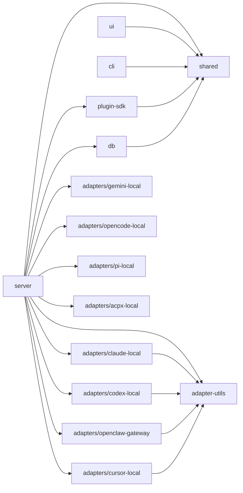

# Codebase Map — コード地図

## Annotated ディレクトリツリー

```
paperclip/
│
├── server/                   # 【コア】Express.js API サーバー
│   └── src/
│       ├── index.ts          # サーバーエントリポイント（DB初期化・起動）
│       ├── app.ts            # Express アプリ（全ルート登録）
│       ├── config.ts         # 設定読み込み（ENV + config.json）
│       ├── config-file.ts    # config.json の読み書き
│       ├── routes/           # HTTP ルートハンドラー（40+ ファイル）
│       │   ├── issues.ts     # 【最大】タスク管理API（3500行超）
│       │   ├── agents.ts     # エージェントCRUD
│       │   ├── companies.ts  # 会社管理
│       │   ├── auth.ts       # 認証（Better Auth）
│       │   ├── heartbeat.ts  # ハートビートトリガー
│       │   └── ...
│       ├── services/         # ビジネスロジック（80+ ファイル）
│       │   ├── heartbeat.ts  # 【心臓部】ハートビート実行エンジン（9000行）
│       │   ├── issues.ts     # タスク状態管理・楽観ロック
│       │   ├── budgets.ts    # 予算ポリシー・コスト強制
│       │   ├── secrets.ts    # シークレット管理（暗号化）
│       │   ├── routines.ts   # スケジュール済みルーティン
│       │   ├── approvals.ts  # Board 承認ワークフロー
│       │   ├── plugin-*.ts   # プラグインシステム（20+ ファイル）
│       │   └── ...
│       ├── adapters/         # エージェントアダプターレジストリ
│       │   ├── registry.ts   # 全アダプターの登録・ルックアップ
│       │   └── utils.ts      # アダプター共通ユーティリティ
│       ├── auth/             # Better Auth 設定
│       ├── middleware/       # Express middleware
│       │   ├── auth.ts       # アクター識別（Board/Agent/User）
│       │   ├── logger.ts     # HTTP ロギング
│       │   └── validate.ts   # Zod バリデーション
│       ├── realtime/         # WebSocket（ライブイベント）
│       │   └── live-events-ws.ts
│       ├── storage/          # ファイルストレージ抽象
│       └── secrets/          # シークレットプロバイダー
│
├── ui/                       # React ダッシュボード
│   └── src/
│       ├── main.tsx          # アプリエントリポイント
│       ├── App.tsx           # ルートコンポーネント + ルーティング
│       ├── pages/            # ページコンポーネント（60+ ファイル）
│       │   ├── IssueDetail.tsx   # タスク詳細画面
│       │   ├── Issues.tsx        # タスク一覧
│       │   ├── AgentDetail.tsx   # エージェント詳細
│       │   ├── Dashboard.tsx     # ダッシュボード
│       │   ├── Goals.tsx         # ゴール管理
│       │   └── ...
│       ├── components/       # 共通 UI コンポーネント
│       ├── api/              # API クライアント関数
│       ├── context/          # React Context プロバイダー
│       │   ├── CompanyContext.tsx     # 選択中の会社
│       │   ├── LiveUpdatesProvider.tsx # WebSocket SSE
│       │   └── ...
│       └── plugins/          # プラグイン UI ブリッジ
│
├── cli/                      # CLI ツール (@paperclipai/cli)
│   └── src/
│       ├── index.ts          # CLI エントリポイント
│       └── commands/         # サブコマンド実装
│           ├── onboard.ts    # 初回セットアップ
│           ├── run.ts        # サーバー起動
│           ├── configure.ts  # 設定対話
│           ├── doctor.ts     # ヘルスチェック
│           ├── worktree.ts   # worktree 管理
│           └── client/       # リモート CLI クライアント
│
├── packages/
│   ├── db/                   # DB スキーマ・マイグレーション
│   │   └── src/
│   │       ├── schema/       # Drizzle テーブル定義（74 ファイル）
│   │       ├── migrations/   # SQL マイグレーションファイル
│   │       ├── client.ts     # DB 接続
│   │       └── index.ts      # エクスポート
│   │
│   ├── shared/               # 共有型・定数・バリデーション
│   │   └── src/
│   │       ├── index.ts      # メインエクスポート
│   │       └── ...           # 型定義・定数
│   │
│   ├── adapter-utils/        # アダプター共通ユーティリティ
│   │   └── src/
│   │       ├── types.ts      # アダプターインターフェース定義
│   │       ├── server-utils.ts # サーバー側ユーティリティ
│   │       └── execution-target.ts # 実行ターゲット管理
│   │
│   ├── adapters/             # エージェントアダプター実装
│   │   ├── claude-local/     # Claude Code アダプター
│   │   ├── codex-local/      # Codex アダプター
│   │   ├── cursor-local/     # Cursor アダプター
│   │   ├── gemini-local/     # Gemini アダプター
│   │   ├── openclaw-gateway/ # OpenClaw WebSocket ゲートウェイ
│   │   ├── opencode-local/   # OpenCode アダプター
│   │   ├── pi-local/         # Pi アダプター
│   │   └── acpx-local/       # ACPX アダプター
│   │
│   ├── mcp-server/           # MCP (Model Context Protocol) サーバー
│   │
│   └── plugins/
│       ├── sdk/              # プラグイン開発 SDK
│       └── examples/         # サンプルプラグイン
│
├── doc/                      # 内部設計ドキュメント
├── docs/                     # 公開ドキュメント (Mintlify)
├── skills/                   # エージェントスキル定義（マークダウン）
├── evals/                    # LLM 評価スクリプト (promptfoo)
├── scripts/                  # ビルド・リリーススクリプト
├── tests/                    # E2E テスト
└── docker/                   # Docker/Compose 設定
```

---

## 「何を修正するには？」速查表

| やりたいこと | 見るべき場所 | 关鍵ファイル |
|------------|------------|------------|
| 新しい API エンドポイントを追加 | `server/src/routes/` | 対応するルートファイル、`app.ts` |
| 新しいエージェントアダプターを追加 | `packages/adapters/<name>/` | `index.ts`, `server/index.ts`, `registry.ts` |
| DB テーブルを追加・変更 | `packages/db/src/schema/` | テーブル定義ファイル + `db:generate` |
| ハートビート実行ロジックを修正 | `server/src/services/heartbeat.ts` | 9000 行の核心ファイル |
| エージェントへの context ペイロードを修正 | `server/src/services/heartbeat.ts:1789` | `buildPaperclipWakePayload()` |
| 予算・コスト処理を修正 | `server/src/services/budgets.ts` | `budgetService()` |
| 承認ワークフローを修正 | `server/src/services/approvals.ts` | `approvalService()` |
| Issue の状態遷移を修正 | `server/src/services/issues.ts` | `assertTransition()`, `checkout()`, `release()` |
| 認証ロジックを修正 | `server/src/middleware/auth.ts` | `actorMiddleware()` |
| React UI ページを追加 | `ui/src/pages/` | `App.tsx` にルートも追加 |
| UI コンポーネントを追加 | `ui/src/components/` | 対応コンポーネントファイル |
| CLI コマンドを追加 | `cli/src/commands/` | `index.ts` にも登録 |
| プラグインシステムを拡張 | `server/src/services/plugin-*.ts` | `plugin-host-services.ts` |
| スケジュール済みルーティンを修正 | `server/src/services/routines.ts` | `routineService()` |
| シークレット管理を修正 | `server/src/services/secrets.ts` | `secretService()` |
| ストレージプロバイダーを追加 | `server/src/storage/` | `provider-registry.ts` |
| エージェントスキルを追加 | `skills/` | マークダウンファイルを追加 |
| デプロイモードを修正 | `server/src/config.ts` | `loadConfig()`, `DEPLOYMENT-MODES.md` |
| Worker worktree 設定を修正 | `server/src/worktree-config.ts` | - |
| テレメトリを修正 | `server/src/telemetry.ts` | - |
| DB マイグレーションを作成 | `packages/db/src/migrations/` | `db:generate` → `db:migrate` |
| 設定スキーマを変更 | `server/src/config.ts`, `server/src/config-file.ts` | `Config` インターフェース |

---

## モジュール依存関係図



---

## テスト配置

| テスト種別 | 場所 | 実行コマンド |
|----------|-----|------------|
| ユニット・統合（Vitest） | `**/__tests__/*.ts`, `**/*.test.ts` | `pnpm test` |
| E2E（Playwright） | `tests/e2e/` | `pnpm test:e2e` |
| リリーススモーク | `tests/release-smoke/` | `pnpm test:release-smoke` |
| プラグイン SDK テスト | `packages/plugins/sdk/src/**/*.test.ts` | `pnpm test` |
| DB テスト | `packages/db/src/**/*.test.ts` | `pnpm test` |
| LLM 評価 | `evals/promptfoo/` | `pnpm evals:smoke` |
