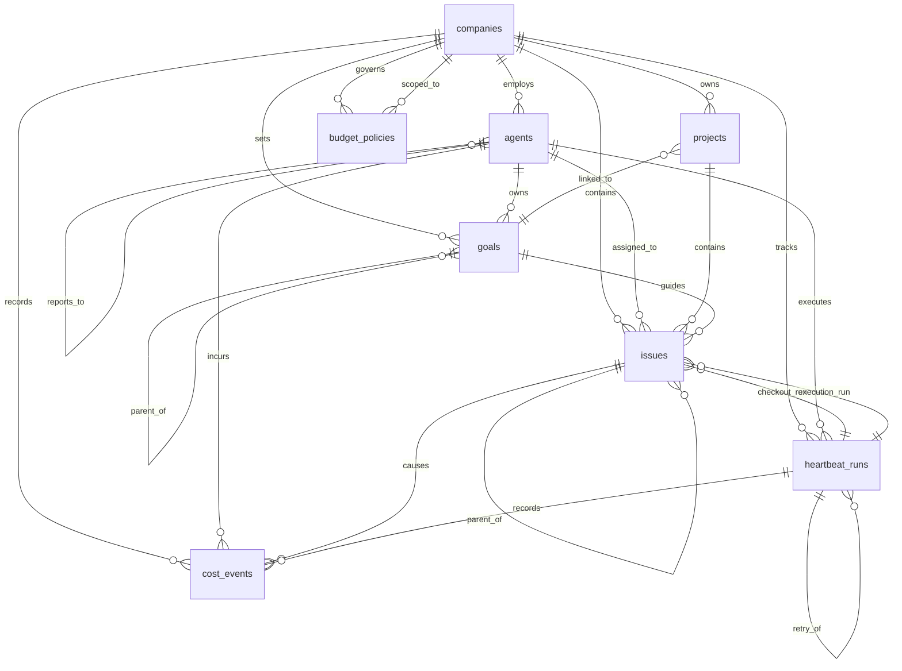
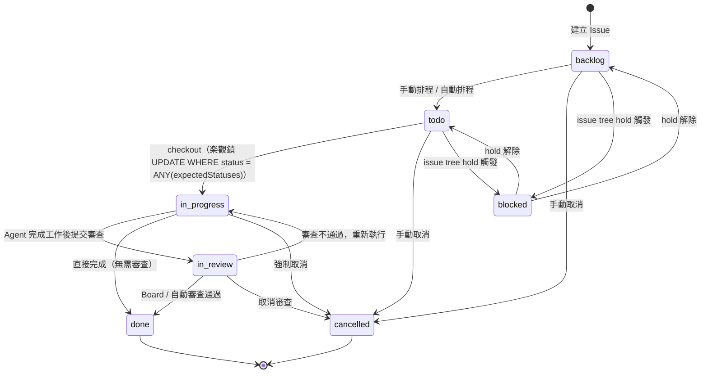
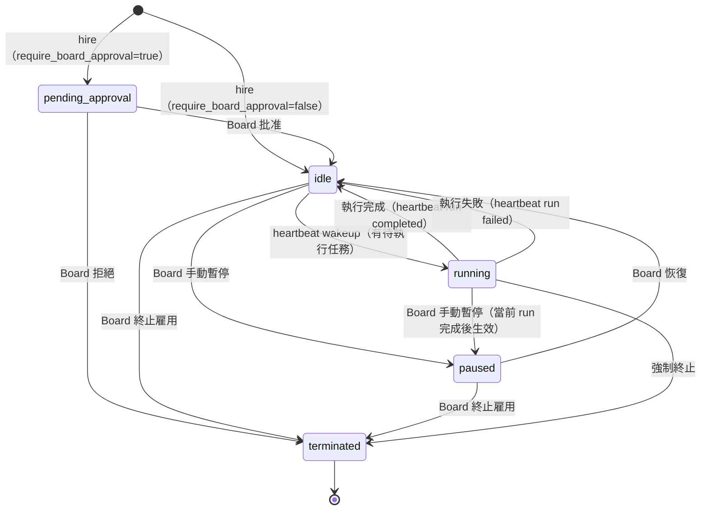

# DATA_MODEL — Paperclip 資料模型文件

> 本文件描述 Paperclip 專案的核心資料結構、實體關聯與狀態機。
> 資料庫使用 PostgreSQL（可嵌入式或外部），ORM 為 **Drizzle ORM v0.38.4+**。
> 全部 schema 定義位於 `packages/db/src/schema/`（約 70 張資料表）。

---

## 1. 核心實體清單

### 1.1 companies（公司）

| 欄位 | 型別 | 說明 |
|------|------|------|
| `id` | uuid PK | 主鍵 |
| `name` | text NOT NULL | 公司名稱 |
| `description` | text | 公司描述 |
| `status` | text DEFAULT `active` | 狀態（active / paused） |
| `pause_reason` | text | 暫停原因 |
| `issue_prefix` | text UNIQUE DEFAULT `PAP` | Issue 識別碼前綴 |
| `issue_counter` | integer DEFAULT 0 | Issue 序號計數器 |
| `budget_monthly_cents` | integer DEFAULT 0 | 月度預算上限（美分） |
| `spent_monthly_cents` | integer DEFAULT 0 | 當月已消費金額（美分） |
| `require_board_approval_for_new_agents` | boolean DEFAULT false | 新增 Agent 是否需要 Board 審批 |
| `brand_color` | text | 品牌顏色 |
| `created_at` / `updated_at` | timestamptz | 時間戳 |

### 1.2 agents（AI 代理人）

| 欄位 | 型別 | 說明 |
|------|------|------|
| `id` | uuid PK | 主鍵 |
| `company_id` | uuid FK→companies | 所屬公司 |
| `name` | text NOT NULL | Agent 名稱 |
| `role` | text DEFAULT `general` | 職位角色 |
| `title` | text | 職稱 |
| `status` | text DEFAULT `idle` | 狀態（見狀態機） |
| `reports_to` | uuid FK→agents | 上級 Agent（自我參照，組織架構） |
| `adapter_type` | text DEFAULT `process` | 執行器類型（claude_local 等） |
| `adapter_config` | jsonb | 執行器設定 |
| `runtime_config` | jsonb | 執行期設定 |
| `default_environment_id` | uuid FK→environments | 預設執行環境 |
| `budget_monthly_cents` | integer DEFAULT 0 | Agent 月度預算上限（美分） |
| `spent_monthly_cents` | integer DEFAULT 0 | 當月已消費金額（美分） |
| `permissions` | jsonb | 許可權設定 |
| `last_heartbeat_at` | timestamptz | 最後心跳時間 |
| `created_at` / `updated_at` | timestamptz | 時間戳 |

### 1.3 issues（任務）

| 欄位 | 型別 | 說明 |
|------|------|------|
| `id` | uuid PK | 主鍵 |
| `company_id` | uuid FK→companies | 所屬公司 |
| `project_id` | uuid FK→projects | 所屬專案 |
| `goal_id` | uuid FK→goals | 關聯目標 |
| `parent_id` | uuid FK→issues | 父任務（自我參照，形成樹狀結構） |
| `title` | text NOT NULL | 任務標題 |
| `description` | text | 任務描述 |
| `status` | text DEFAULT `backlog` | 狀態（見狀態機） |
| `priority` | text DEFAULT `medium` | 優先度（urgent / high / medium / low） |
| `assignee_agent_id` | uuid FK→agents | 指派的 Agent |
| `assignee_user_id` | text | 指派的使用者 ID |
| `checkout_run_id` | uuid FK→heartbeat_runs | 目前 checkout 的 run |
| `execution_run_id` | uuid FK→heartbeat_runs | 目前執行中的 run（執行鎖） |
| `execution_locked_at` | timestamptz | 執行鎖時間 |
| `identifier` | text UNIQUE | 人類可讀識別碼（例：PAP-42） |
| `issue_number` | integer | 序號 |
| `origin_kind` | text DEFAULT `manual` | 來源類型（manual / routine_execution 等） |
| `request_depth` | integer DEFAULT 0 | 子任務深度 |
| `billing_code` | text | 計費代碼 |
| `execution_policy` | jsonb | 執行策略（mode / stages / monitor） |
| `execution_workspace_id` | uuid FK→execution_workspaces | 執行工作區 |
| `monitor_next_check_at` | timestamptz | 監控下次檢查時間 |
| `started_at` / `completed_at` / `cancelled_at` | timestamptz | 生命週期時間戳 |
| `created_at` / `updated_at` | timestamptz | 時間戳 |

### 1.4 heartbeat_runs（心跳執行記錄）

| 欄位 | 型別 | 說明 |
|------|------|------|
| `id` | uuid PK | 主鍵 |
| `company_id` | uuid FK→companies | 所屬公司 |
| `agent_id` | uuid FK→agents | 執行的 Agent |
| `invocation_source` | text DEFAULT `on_demand` | 觸發來源 |
| `status` | text DEFAULT `queued` | 狀態（queued / running / completed / failed） |
| `started_at` / `finished_at` | timestamptz | 執行時間範圍 |
| `error` / `error_code` | text | 錯誤資訊 |
| `exit_code` | integer | 子程序結束碼 |
| `usage_json` | jsonb | Token 使用量摘要 |
| `session_id_before` / `session_id_after` | text | Claude session 連續性 ID |
| `log_ref` / `log_bytes` / `log_sha256` | text / bigint / text | 日誌儲存參照 |
| `process_pid` / `process_group_id` | integer | 子程序 PID |
| `retry_of_run_id` | uuid FK→heartbeat_runs | 重試來源 Run（自我參照） |
| `liveness_state` / `liveness_reason` | text | 活躍度狀態（Watchdog 使用） |
| `context_snapshot` | jsonb | 執行時的完整上下文快照 |
| `created_at` / `updated_at` | timestamptz | 時間戳 |

### 1.5 goals（目標）

| 欄位 | 型別 | 說明 |
|------|------|------|
| `id` | uuid PK | 主鍵 |
| `company_id` | uuid FK→companies | 所屬公司 |
| `title` | text NOT NULL | 目標標題 |
| `description` | text | 目標描述 |
| `level` | text DEFAULT `task` | 目標層級（company / project / task） |
| `status` | text DEFAULT `planned` | 狀態（planned / active / completed / cancelled） |
| `parent_id` | uuid FK→goals | 父目標（自我參照） |
| `owner_agent_id` | uuid FK→agents | 負責 Agent |
| `created_at` / `updated_at` | timestamptz | 時間戳 |

### 1.6 projects（專案）

| 欄位 | 型別 | 說明 |
|------|------|------|
| `id` | uuid PK | 主鍵 |
| `company_id` | uuid FK→companies | 所屬公司 |
| `goal_id` | uuid FK→goals | 關聯目標 |
| `name` | text NOT NULL | 專案名稱 |
| `description` | text | 專案描述 |
| `status` | text DEFAULT `backlog` | 狀態 |
| `lead_agent_id` | uuid FK→agents | 負責 Agent |
| `target_date` | date | 目標完成日期 |
| `env` | jsonb | 環境變數設定（AgentEnvConfig） |
| `pause_reason` / `paused_at` | text / timestamptz | 暫停資訊 |
| `created_at` / `updated_at` | timestamptz | 時間戳 |

### 1.7 budget_policies（預算策略）

| 欄位 | 型別 | 說明 |
|------|------|------|
| `id` | uuid PK | 主鍵 |
| `company_id` | uuid FK→companies | 所屬公司 |
| `scope_type` | text NOT NULL | 套用範圍類型（company / project / agent） |
| `scope_id` | uuid NOT NULL | 套用範圍 ID |
| `metric` | text DEFAULT `billed_cents` | 計量指標 |
| `window_kind` | text NOT NULL | 計算窗口（monthly / lifetime） |
| `amount` | integer DEFAULT 0 | 預算金額（美分） |
| `warn_percent` | integer DEFAULT 80 | 警告閾值百分比 |
| `hard_stop_enabled` | boolean DEFAULT true | 是否強制停止 |
| `is_active` | boolean DEFAULT true | 策略是否啟用 |
| `created_at` / `updated_at` | timestamptz | 時間戳 |

### 1.8 cost_events（費用事件）

| 欄位 | 型別 | 說明 |
|------|------|------|
| `id` | uuid PK | 主鍵 |
| `company_id` | uuid FK→companies | 所屬公司 |
| `agent_id` | uuid FK→agents | 執行的 Agent |
| `issue_id` | uuid FK→issues | 關聯任務 |
| `project_id` | uuid FK→projects | 關聯專案 |
| `goal_id` | uuid FK→goals | 關聯目標 |
| `heartbeat_run_id` | uuid FK→heartbeat_runs | 關聯執行 Run |
| `billing_code` | text | 計費代碼 |
| `provider` | text NOT NULL | LLM 提供商（anthropic 等） |
| `model` | text NOT NULL | 模型名稱 |
| `input_tokens` / `cached_input_tokens` / `output_tokens` | integer | Token 使用量 |
| `cost_cents` | integer NOT NULL | 費用（美分） |
| `occurred_at` | timestamptz NOT NULL | 費用發生時間 |

---

## 2. ER Diagram



---

## 3. DB スキーマ摘要

### companies — 組織根節點

`companies` 是整個系統的根節點。所有實體均透過 `company_id` 歸屬於特定公司，實現多租戶隔離。`issue_prefix`（如 `PAP`）搭配 `issue_counter` 自動產生 `PAP-1`、`PAP-2` 等人類可讀的 Issue 識別碼。`budget_monthly_cents` 與 `spent_monthly_cents` 儲存公司級即時預算狀態。

### agents — AI 代理人員工

`agents.reports_to` 自我參照欄位建立組織圖樹狀結構，支援 CEO → 部門主管 → 員工的層級設計。`adapter_type` 決定 Agent 使用哪種執行器（`claude_local`、`codex_local`、`openclaw_gateway` 等），`adapter_config` 存放對應設定（API key refs、model 等）。

### issues — 任務與工作單元

`issues` 透過 `parent_id` 形成任意深度的任務樹。`execution_run_id` 作為分散式執行鎖，配合 `execution_locked_at`，防止多個 Agent 同時執行同一任務。`origin_kind` 紀錄任務來源（`manual`、`routine_execution`、`harness_liveness_escalation` 等），支援系統自動產生的復原任務。多個部份索引（partial index）確保系統任務（liveness recovery、stranded issue recovery 等）的唯一性。

### heartbeat_runs — 執行快照

每次 Agent 被喚醒執行即創建一筆 `heartbeat_runs` 記錄，是 Paperclip 執行引擎的核心日誌。`session_id_before` / `session_id_after` 支援 Claude Code 的跨 heartbeat 會話連續性。`liveness_state` 供 Watchdog 監控執行活躍度，偵測無回應的 Run。`retry_of_run_id` 自我參照支援自動重試鏈結。

### budget_policies — 階層式預算策略

採用 `scope_type`（`company` / `project` / `agent`）+ `scope_id` 的通用設計，一張資料表覆蓋三個層級的預算策略。`window_kind` 支援 `monthly`（每月重置）與 `lifetime`（累積）兩種模式。`hard_stop_enabled` 控制是否在超出 `amount` 時強制中止 Agent 執行。

### cost_events — 細粒度費用追蹤

設計為僅追加（append-only）的事件流，記錄每次 LLM 呼叫的 Token 費用，並關聯到 company / agent / project / goal / issue / heartbeat_run 六個維度，支援多角度的費用分析查詢。

---

## 4. Issue 生命週期

### 狀態說明

| 狀態 | 說明 |
|------|------|
| `backlog` | 已建立但尚未排程 |
| `todo` | 已排程，等待執行 |
| `in_progress` | Agent 正在執行（`execution_run_id` 已設定） |
| `in_review` | 完成後等待審查 |
| `done` | 已完成 |
| `cancelled` | 已取消 |
| `blocked` | 被外部條件封鎖（issue tree hold 等） |

### 狀態遷移圖



> **楽觀鎖機制**：checkout 時執行 `UPDATE issues SET status='in_progress' WHERE id=? AND status=ANY(expectedStatuses)`，若 `expectedStatuses` 不符（他人已搶先執行）則回傳 `409 Conflict`。

---

## 5. Agent 狀態機

### 狀態說明

| 狀態 | 說明 |
|------|------|
| `idle` | 閒置，等待任務喚醒 |
| `running` | 正在執行任務（heartbeat run 進行中） |
| `paused` | 被暫停（`paused_at` 已設定） |
| `pending_approval` | 新雇用 Agent 等待 Board 審批 |
| `terminated` | 已終止，不再接受新任務 |

### 狀態遷移圖



> ⚠️ 未驗證：`running → paused` 的確切語義（立即中止或等待當前 run 結束）需進一步確認 `server/src/services/heartbeat.ts` 的實作細節。

---

## 6. Migration 機制

### Drizzle ORM Migration 管理

Paperclip 使用 **Drizzle ORM** 管理資料庫 schema 與 migration：

| 項目 | 詳細 |
|------|------|
| Schema 定義位置 | `packages/db/src/schema/*.ts`（約 70 個檔案） |
| Migration 輸出位置 | `packages/db/src/migrations/` |
| Migration 生成指令 | `pnpm drizzle-kit generate`（從 schema diff 自動生成 SQL） |
| Migration 套用指令 | `pnpm drizzle-kit migrate`（套用至 PostgreSQL） |
| ORM 版本 | Drizzle ORM `^0.38.4` |

### 運作方式

1. **Schema First**：開發者修改 `packages/db/src/schema/` 中的 TypeScript 定義。
2. **自動差異比對**：`drizzle-kit generate` 比較現有 schema 與上次 migration snapshot，產生 `.sql` migration 檔案。
3. **Migration 追蹤**：Drizzle 在資料庫中維護 `__drizzle_migrations` 資料表，記錄已套用的 migration 版本。
4. **啟動時自動套用**：`server/src/index.ts` 在伺服器啟動時呼叫 DB 初始化，自動套用未執行的 migration。
5. **Embedded PostgreSQL 支援**：使用 `embedded-postgres`（v18.1.0-beta.16）時，migration 在本機資料庫上自動執行，無需外部 Postgres 設定。

### 本地開發流程

```
修改 packages/db/src/schema/*.ts
    ↓
pnpm drizzle-kit generate   # 產生 migration SQL
    ↓
pnpm drizzle-kit migrate    # 套用至本地 DB
    ↓
server 重啟時自動套用新 migration
```

> ⚠️ 未驗證：`DATABASE_URL` 未設定時的 embedded postgres 初始化路徑需確認 `server/src/index.ts` 的具體實作。

---

## 附錄：其他重要資料表（簡述）

| 資料表 | 用途 |
|--------|------|
| `activity_log` | 所有變更操作的審計日誌 |
| `agent_wakeup_requests` | DB-backed 喚醒請求佇列 |
| `agent_task_sessions` | Agent 跨 heartbeat 的 session 連續性（`sessionId` 保存） |
| `approvals` | Board 審批請求（Agent 雇用、設定變更等） |
| `agent_config_revisions` | Agent 設定變更歷史（支援回滾） |
| `issue_tree_holds` / `issue_tree_hold_members` | Issue 樹狀暫停控制 |
| `heartbeat_run_events` | 執行 Run 的即時串流日誌事件 |
| `plugins` / `plugin_state` | 外掛程式生命週期管理 |
| `routines` | 定期排程任務定義 |
| `environments` / `execution_workspaces` | 執行環境與工作區管理 |
| `company_secrets` / `company_secret_versions` | 加密金鑰/憑證管理 |
